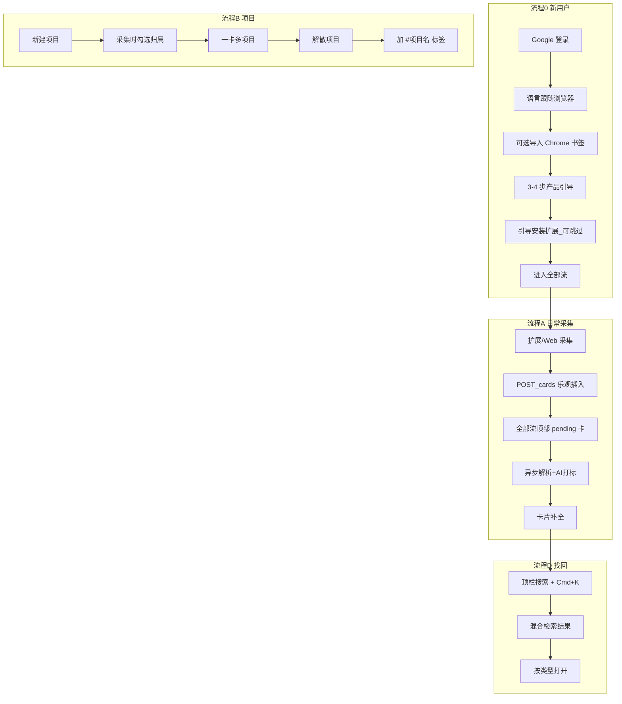

# 个人知识资产收藏系统 — 完整产品与技术方案（v2.19 / Hoardly 对齐版）

本文档是唯一权威版本，整合此前所有讨论内容（mymind / Cubox / Raindrop / Eagle 竞品参考、解析引擎、AI 打标签、项目文件夹、Skill 知识资产、数据导出、定期维护机制），并纳入 2026-07 产品细节确认结论。后续开发以本文档为准，不再需要对照其他文件。

## 目录

0. 产品命名与定位（Hoardly）
1. 产品概述与设计哲学
2. 目标用户与核心场景
3. 竞品参考与取舍
4. 功能地图总览
5. 内容类型与卡片模型
5.1 卡片 UI 规范与点击行为
5.2 网页高亮与笔记
5.3 交互体验基线
6. 采集模块（自动化入口）
7. 手动创建模块（与采集功能对等）
8. 解析引擎
9. AI 自动打标签（含多语言策略）
9.1 界面与内容多语言（i18n）
9.2 AI 模型接入与用户配置
10. 组织与整理逻辑
11. 内容与标签健康检查（定期维护机制）
12. 查找与发现模块（关键词/语义/以图搜索/语音对话）
13. AI 主动推荐与问答（Agentic RAG）
14. 完整增删改查（CRUD）规范
15. 知识资产 Skill 化
16. 数据导出与开放 API
17. 完整数据模型
18. 系统架构（含云端/本地混合存储）
19. 技术栈
20. 非功能性需求
21. 开发优先级（能力清单，非版本分期）
22. 风险与开放问题
23. 信息架构与核心用户流程
24. Hoardly 现有实现与迁移路径
25. 已确认产品决策记录
26. 账号、认证与多设备同步
27. 技术选型原则：复用成熟方案（不自研清单）
28. 前瞻性差异化路线（对竞品的攻击点）

---

## 零、产品命名与定位（Hoardly）

**产品名**：Hoardly（工作代号；对外可称「个人知识资产收藏系统」）

**一句话定位**：Raindrop 的视觉卡片体验 × MyMind 的零整理采集哲学 × 浏览器式临时项目工作区 —— 一个不强迫分类、什么都能收、AI 帮你理解和找回、并能把碎片收藏沉淀成可复用知识资产的私人灵感中枢。

**与竞品的核心差异**：

| 维度 | Raindrop | MyMind | Cubox | Hoardly |
|------|----------|--------|-------|---------|
| 默认组织 | 嵌套收藏夹 | 无文件夹，统一池 | 收藏夹+标签 | **无永久文件夹**，统一全部流 |
| 项目上下文 | 用收藏夹模拟 | 无 | 文件夹 | **临时项目区**，解散→标签 |
| 标签 | 手动为主 | AI 自动 | AI+手动 | **多语言 AI 标签**（随用户界面语言展示） |
| 内容类型 | 链接为主 | 图/链/笔记 | 多平台解析 | 全平台采集+本地文件 |
| 跨端 | 云端同步 | 云端 | 云端 | **云端主库 + 按类型可选本地大文件** |

**产品双阶段价值**：
1. **采集期（灵感工具）**：1 秒收藏、异步理解、卡片流浏览
2. **沉淀期（知识资产）**：项目解散留痕、Skill 知识包、开放导出

---

## 一、产品概述与设计哲学

**一句话定位**：一个不强迫分类、什么内容都能收、AI 帮你理解和找回、并能把碎片收藏沉淀成可复用知识资产的个人信息中枢。

**五条设计哲学（贯穿全文档，后续所有功能设计不得违背）**：

1. **采集永远优先于整理**——用户按下"收藏"的一刻必须在 1 秒内看到反馈，任何解析/打标签都是异步的，绝不能阻塞采集动作。
2. **不强制分类，但要能整理**——默认进统一信息池；整理工具为**标签 + 临时项目 + 可选智能文件夹**，**不采用 Raindrop 式嵌套收藏夹树**作为一级导航。
3. **数据不被锁死**——云端主库 + 标准格式导出 + 大文件可按类型选择仅存本地；任何时候用户都能把元数据与可访问的文件完整搬走。
4. **收藏是手段，知识资产化是目的**——所有采集、整理最终要能沉淀成可被自己或他人复用的结构化知识（对应 Skill 化功能），而不是一个只会变大的垃圾场。
5. **默认不拆文件夹，整理靠标签与临时项目**——用户 90% 时间只需浏览「全部流」时间线；需要上下文时用「进行中项目」集中资源，项目结束后解散为项目名标签。智能文件夹作为高级可选能力，不占主导航首位。

---

## 二、目标用户与核心场景

**核心用户画像**：高强度信息消费者——日常在网页、社交媒体（推特/Reddit/Instagram/Facebook/小红书/抖音）、视频平台（YouTube/B站/TikTok）之间跳转，经常做主题性研究或项目型工作，希望收藏的内容既能"随手扔"又能在需要时"精准捞回来"。

**核心用户故事**：
- 作为用户，我刷到一篇文章/一条推文/一个视频，希望一键收藏且不用当下决定放哪个分类。
- 作为用户，我在做一个具体项目时，希望把相关链接、笔记、参考资料集中在一个临时空间里；一张卡片可以同时出现在多个进行中项目里；项目结束后这个空间可以解散，但内容依然能通过项目名标签搜到。
- 作为用户，我隐约记得收藏过一张类似风格的图，但想不起标题，希望能用一张图或一句话描述找回它。
- 作为用户，我希望把某个主题下积累的资料一键整理成一份可以直接给别人看、或者喂给 AI 用的知识包。
- 作为用户，我希望即使某天不用这个产品了，也能把所有数据完整导出，不被平台锁死。
- 作为用户，我不想手动维护一堆死链接和过时标签，希望系统能定期帮我检查、我只需要做"是否删除/是否接受建议"的简单决策。
- 作为用户，我希望视频等大文件可以只存在自己电脑上节省云端空间，但云端仍能记住这条收藏，我在本机点击时能直接播放本地文件。

---

## 三、竞品参考与取舍

| 产品 | 借鉴点 | 不采用的部分 |
|---|---|---|
| mymind | 无压力收集，不强制分类，AI 自动理解内容 | 纯靠搜索找回、缺乏可视化整理入口；**缺乏项目型工作上下文**；API 封闭无 MCP |
| Raindrop.io | 精美卡片、og 元数据+截图兜底、高亮批注、跨端同步；**已有官方 MCP** | **嵌套收藏夹树**（与 MyMind 哲学冲突）、纯链接思路、手动整理压力大 |
| Cubox | 多平台解析（小红书/推特/公众号独立适配） | 嵌套收藏夹+标签双层结构；标签仍需较多手动维护 |
| Eagle | 本地优先、多格式支持、颜色提取与检索、一物多归属不重复占用存储 | 无云端语义理解，检索停留在属性筛选层面 |
| **Fabric**（2026 强势竞品） | 全格式 first-class（PDF/音视频/邮件/截图）、语义+视觉+颜色搜索、**AI 回答带引用出处**、从 Raindrop/Evernote/Mymind 一键迁移 | 试图替代笔记+网盘+任务的「全家桶」野心（范围过大）；无项目生命周期 |
| **Recall** | 知识图谱自动关联、**Augmented Browsing**（浏览网页时自动浮现库内相关内容）、多模型聊天（个人库+联网混合） | spaced repetition 学习卡片（偏学习工具心智）；无 MCP |
| Readwise Reader | 高亮 Q&A、稍后读体验标杆、highlights MCP | 深度阅读器心智（28.6 明确不追） |
| Karakeep / Burn 451（开源/独立） | **MCP Server 已是品类标配的证据**；本地 Ollama 打标（自托管人群） | 自托管复杂度；无云端体验打磨 |
| MarkIt | **Telegram/WhatsApp 机器人采集**（聊天场景零摩擦） | 仅聊天入口，无库端深度 |

> **2026 竞争格局判断**：MCP/AI 代理接入已从「前瞻」变成「标配」（Raindrop、Readwise、Karakeep、Burn 451 均已上线）；竞争焦点转向 **谁的召回质量高、谁能主动归还记忆、谁的采集摩擦最低**。Hoardly 的护城河组合：项目生命周期（独有）× **多语言标签与摘要** × **全球+中文社交平台解析**（Reddit/Instagram/Facebook + 小红书/抖音/B站，海外竞品在中文平台上全部缺失）。

---

## 四、功能地图总览

```
┌───────────────────────────────────────────────┐
│                   内容入口层                     │
│  自动采集（浏览器扩展/分享/剪贴板检测）              │
│  手动创建（链接/文字/图片/视频/文件/语音）— 与采集对等 │
│  Chrome 书签：仅导入，不作为主库                      │
└───────────────────────────────────────────────┘
                      │
┌───────────────────────────────────────────────┐
│                   解析与理解层                    │
│  PlatformAdapter 路由 → 各平台/格式 Worker        │
│  AI 自动打标签（多语言、收敛式，复用已有标签库）         │
└───────────────────────────────────────────────┘
                      │
┌───────────────────────────────────────────────┐
│                   组织与整理层                    │
│  全部流（默认，最近/智能排序）                        │
│  标签云 / 进行中项目（多对多）/ 智能文件夹（可选）      │
└───────────────────────────────────────────────┘
                      │
┌───────────────────────────────────────────────┐
│                维护与体检层（定期任务）             │
│  链接有效性检查 / 标签体系体检 / 体检报告与用户确认    │
└───────────────────────────────────────────────┘
                      │
┌───────────────────────────────────────────────┐
│                   查找与发现层                    │
│  关键词搜索 / 语义搜索 / 以图搜索 / 语音对话搜索       │
│  AI 主动推荐（长期兴趣画像）/ Agentic 问答           │
└───────────────────────────────────────────────┘
                      │
┌───────────────────────────────────────────────┐
│                   资产化与开放层                  │
│  知识包（Skill）生成与分享                         │
│  数据导出（HTML/Markdown/JSON/ZIP）/ 只读 API      │
└───────────────────────────────────────────────┘
```

---

## 五、内容类型与卡片模型

所有内容最终都以"卡片"形式存在，无论来自采集还是手动创建，卡片结构完全一致：

| 字段 | 说明 |
|---|---|
| 标题 | AI 生成或用户输入 |
| 缩略图 | 自动解析或用户手动替换 |
| 类型 | 见下方完整枚举 |
| 摘要 | AI 生成，**10 种语言存储**；展示随用户 `language` 设置 |
| 标签 | **AI 自动生成即生效**；约 **10 个标签**存库；卡片列表展示 **3–5 个**，详情页展示**全部**；多语言结构见第九节 |
| 来源平台 | 用于展示图标和路由到对应解析器 |
| 添加日期 | 自动记录；列表展示相对时间 |
| 所属项目 | **可属于 0 个或多个进行中项目**（多对多） |
| 项目历史标签 | **通过 `card_tags`（origin=project）实现**，非独立字段；解散项目时写入 |
| 解析状态 | `pending` / `ready` / `failed` / `invalid` |
| 存储位置 | `cloud` / `local` / `hybrid`（见第十八节） |
| 状态 | **星标** / 回收站 / 链接已失效；**不做未读/已读、不做归档**（已确认） |
| 星标 | 用户手动标记的"重要"状态 |

**内容类型完整枚举**：

`web` · `tweet` · `reddit` · `instagram` · `facebook` · `threads` · `linkedin` · `xhs` · `douyin` · `youtube` · `tiktok` · `bilibili` · `medium` · `pinterest` · `wechat` · `video` · `image` · `note` · `pdf` · `doc` · `voice_note`

> 社交平台类（`tweet` / `reddit` / `instagram` / `facebook` 等）在卡片上显示**对应平台角标**与作者信息（若可解析）；点击行为同链接类，跳转原文。

**全部流排序模式**（顶部 Segmented Control）：
- **最近**（默认）：`created_at` 降序
- **智能**：见第十三节评分公式

---

## 5.1、卡片 UI 规范与点击行为

### 统一卡片结构

```
┌─────────────────────────────┐
│  [缩略图 16:9]    [平台角标] │  ← YouTube/B站/推特/Reddit/Instagram/Facebook/小红书等
│  [项目色条]（属于活跃项目时）  │  ← 多项目时显示主项目色或叠色提示
├─────────────────────────────┤
│  标题（1-2 行截断，可内联编辑）│
│  摘要（2 行，AI 生成，随语言） │
│  #标签 #标签 #标签  +N        │
├─────────────────────────────┤
│  3小时前  ·  bilibili.com    │  ← 相对时间 + 域名
│  [分析中/本地文件/失效] 角标   │
└─────────────────────────────┘
```

### 字段展示规则

| 字段 | 规则 |
|------|------|
| 缩略图 | 16:9；失败时用平台色块+首字母或类型图标 |
| 标题 | 列表必显 |
| 链接 | 列表仅显示域名；完整 URL 在详情页 |
| 标签 | 最多 **3–5 个** + `+N`；颜色区分 AI/用户/项目/系统 |
| 时间 | 列表用相对时间；详情用绝对时间 |
| 平台角标 | 右下角固定 |
| 项目色条 | 顶部 3px；多项目时可显示多色段或「+N 项目」提示 |

### 布局

- 桌面：3-4 列响应式**等高网格**为默认；支持「**舒适 / 紧凑**」密度切换；可切**列表视图**
- 类型差异化：视频叠加播放按钮+时长；推文显示作者头像+handle；纯文本用渐变底+首句大字；图片以图为主

### UI 视觉规范（已确认）

| 项 | 规则 |
|----|------|
| **组件库** | **shadcn/ui 原生**（初期不做 UI 细节打磨，直接用其默认样式与组件） |
| **主色** | **中性灰白 + 点缀色**——让内容图片说话，品牌色轻量 |
| **暗色模式** | P0 首发：**跟随系统**自动切换（浅/深）；可手动覆盖 |
| **卡片布局** | **等高网格为默认**；可切「列表视图」（类似 Raindrop 紧凑模式） |
| **动效** | **精致过渡**——弹出/滑入/Drawer 开合、卡片 hover 等有明确反馈（Linear 级别）；在万级卡片下优先性能 |

### 点击行为（按内容类型，已确认）

**原则：什么类型像什么，主点击就做该类内容最自然的动作。**

| 卡片类型 | 主点击（卡片体） | 次要入口 |
|----------|------------------|----------|
| `note` 文字笔记 | 打开**文字详情页/Drawer**（全文阅读、编辑） | 外链（若有）在详情内 |
| `web` / `tweet` / `reddit` / `instagram` / `facebook` / `threads` / `linkedin` / `xhs` 等链接类 | **直接打开原文链接**（新标签页） | **Cmd+点击** / 右键 / hover「⋯」→ 详情 Drawer |
| `youtube` / `bilibili` / `douyin` / `tiktok` / `video` | **直接打开播放页或内嵌播放器** | 详情 Drawer 看摘要与标签 |
| `image` | 打开**图片详情/灯箱** | 详情内「打开原图链接」 |
| `pdf` / `doc` | 打开**文档预览器**（云端或调起本地文件） | 下载/打开外链 |
| `voice_note` | 打开**详情页并自动播放**音频 | — |
| 本地存储的大文件 | 本机：直接读取本地文件播放/打开；**他端**：提示「文件存储在 [设备名]，请在该设备访问」并提供元数据预览 | 可选「从本机重新上传云端」 |

> 开发实现：卡片组件根据 `card.type` + `storage_location` 路由到对应 `CardOpenHandler`，不要对所有类型统一用 Drawer 或统一跳外链。

---

## 5.2、网页高亮与笔记

**已确认**：支持类似 Raindrop / Cubox 的**网页划线高亮 + 用户笔记**，不仅依赖 AI 摘要。

### 能力范围

| 能力 | 说明 |
|------|------|
| 文本高亮 | 用户在网页上选中文字 → 扩展菜单「高亮并保存」→ 高亮片段关联到该 URL 卡片 |
| 用户笔记 | 卡片详情内可添加私人笔记（Markdown 或纯文本） |
| 多条高亮 | 同一卡片可挂多条 `highlights`，按页面位置或时间排序 |
| 非网页类型 | `note` 类型整卡即笔记；视频/图片类型仅支持卡片级笔记，不做时间轴高亮（首发） |

### 数据模型

```sql
card_highlights
  id, card_id, quote_text, note_text,
  selector_json,              -- 用于原网页定位（容错）
  color, created_at

card_notes
  id, card_id, body_markdown, updated_at
```

### 采集入口

- 扩展 content script：选区 → **行内浮条**（「高亮 · 笔记 · 收藏」）**+ 右键菜单**「高亮收藏到 Hoardly」——两个入口同时提供
- 若该 URL **尚未收藏**：**自动先创建卡片，再写入 highlight**（一步完成，不打断用户）
- 若 URL **已存在**：在高亮流程中直接追加到已有卡片（见下方去重规则）

### 高亮颜色

- 首发仅**统一黄色**高亮（降低 UI 复杂度）
- P1 可扩展为 4–5 色可选

### 高亮回溯（详情 Drawer 点击高亮条目）

- **智能定位**：若原网页当前仍在浏览器中打开 → 扩展自动滚动到对应位置
- 若原网页未打开 → 提示「在原文中查看」→ 新标签打开并定位到高亮位置（基于 `selector_json` 容错匹配）

### 展示

- 卡片详情 Drawer：「高亮 N 条」折叠列表 + 笔记编辑区
- 全部流卡片角标：有高亮/笔记时显示小图标

---

## 5.3、交互体验基线（对标 2026 品类最佳实践）

竞品调研结论：功能同质化后，**体验细节是留存分水岭**。以下为 Web App 必须达到的交互基线：

| 体验项 | 规范 | 对标 |
|--------|------|------|
| **全局命令面板** | `Cmd/Ctrl+K` 唤起：搜索、新建卡片、切项目、跳设置，全键盘可达 | Linear / Raycast 化的品类标配 |
| **粘贴即收藏** | 在全部流页面直接 `Cmd+V` 粘贴 URL/图片/文本 → 自动创建卡片 | MyMind 招牌体验 |
| **拖拽即收藏** | 拖文件/图片/链接到 Web App 窗口任意位置 → 全屏 drop zone | Fabric / Eagle |
| **乐观 UI** | 保存/打标/移动项目立即反馈，失败再回滚提示 | 所有一线产品 |
| **骨架屏与占位** | 「分析中」卡片显示缩略图骨架 + 标签 shimmer，不闪跳 | — |
| **批量操作** | `Shift+点击` 连选、`Cmd+点击` 多选 → 底部浮条（打标/入项目/删除） | Raindrop |
| **AI 回答必带引用** | 库内问答每条结论**点击可跳到来源卡片**（否则用户不信任 AI 检索） | Fabric 的「proof & citations」 |
| **快捷键保存** | 扩展全局快捷键（默认 `Alt+S`）不点图标直接保存当前页 | Raindrop / Pocket |
| **空状态引导** | 空项目/空标签页给出「从这里开始」动作按钮，不留白屏 | — |

---

## 六、采集模块（自动化入口）

### 入口表

| 入口 | 覆盖内容 | 技术方式 |
|---|---|---|
| **Chrome 扩展（采集器）** | 网页、推文、视频、选区高亮 | WXT + content script；采集后跳转 **Web App** 查看 |
| **Web App 网站（主界面）** | 全部卡片流、项目、搜索、设置 | Next.js 独立站（`app.hoardly.io`），**同 Raindrop/MyMind** |
| 扩展 → 网站 | 「打开库」/ 保存后查看 | 新标签打开 Web App；Supabase Auth session 同步 |
| 扩展 Popup | **预览+保存+项目**；Reddit/X 可选线程；见流程 A 补充 | 不做完整卡片网格 |
| 扩展右键菜单 | 图片、链接、高亮 | `contextMenus` API |
| 移动端分享菜单 | 小红书、App 内分享 | PWA Share Target |
| 剪贴板检测 | 复制的链接 | Web App 打开时检测 |
| 拖拽导入 | 本地文件 | Web App 或 Tauri |
| Chrome 书签导入 | 历史书签 | Web App 内导入；仅导入，独立管理 |
| **邮件转发采集** | 邮件 Newsletter、移动端「分享到邮件」 | 每用户专属地址 `u-xxx@save.hoardly.io`；Resend/邮件服务 inbound webhook → `POST /cards`；**iOS 采集路径的有效补充**（P2） |
| 竞品导入 | Pocket / Raindrop / Cubox 导出文件 | 见第十六节导入表 |

### 扩展 vs 网站分工（Raindrop / MyMind 模式，已确认）

- **扩展** = 采集工具（一键保存、高亮、右键）
- **网站** = 主产品（全部流、卡片浏览、项目管理）
- Hoardly 现有 `entrypoints/app/main.tsx` 全屏页应**迁移合并到 Next.js Web App**，扩展不再承载主 UI

### PlatformAdapter 架构

每种内容类型实现统一接口，输出 `NormalizedCapture`：

```typescript
interface NormalizedCapture {
  type: CardType;
  title: string;
  description?: string;
  thumbnailUrl?: string;
  textForAi: string;       // 送给 LLM 的正文
  canonicalUrl: string;
  platform: string;
}
```

### 平台覆盖与优先级

| 平台 | 检测域名 | 解析策略 | 优先级 |
|------|----------|----------|--------|
| 普通网页 | 默认 | og + Jina/Firecrawl 双通道 | P0 |
| Twitter/X | x.com, twitter.com | oEmbed + meta | P0 |
| YouTube | youtube.com, youtu.be | oEmbed + 封面 + 字幕 | P0 |
| Bilibili | bilibili.com | 页面 meta / API + 字幕 | P0 |
| **Reddit** | reddit.com, old.reddit.com, redd.it | Reddit oEmbed API + og；帖子正文 JSON（公开帖） | **P0** |
| **Instagram** | instagram.com, instagr.am | og meta + 分享页；**登录墙重时扩展截图兜底** | **P0** |
| **Facebook** | facebook.com, fb.com, fb.watch | og meta + 分享 URL；公开帖 meta 优先 | **P0** |
| **Threads** | threads.net | og meta（与 Instagram 同生态） | **P0** |
| **LinkedIn** | linkedin.com | og meta + 公开文章/帖子 meta | **P0** |
| 小红书 | xiaohongshu.com, xhslink.com | 分享页 meta + 客户端捕获 | **P0** |
| 抖音 | douyin.com | 分享页 meta | P1 |
| TikTok | tiktok.com | oEmbed | P1 |
| **Medium / Substack** | medium.com, *.substack.com | 统一长文 Adapter：og + Jina/Firecrawl 全文；角标按域名区分 | **P1** |
| **Pinterest** | pinterest.com, pin.it | og meta + 图片直链 | **P1** |
| **微信公众号** | mp.weixin.qq.com | 分享页 meta + Jina 全文（合规爬取） | **P0** |
| 图片 | image/* | blob + Vision 可选 | P1 |
| 纯文本 | 选区/剪贴板 | 直接存储 | P1 |

### 主流社交平台解析说明（Reddit / Instagram / Facebook 等）

**共同原则**：一律走 `PlatformAdapter` 注册表；输出统一 `NormalizedCapture`；解析失败仍生成卡片（Tier 4 默认卡 + URL 启发式标签）。

| 平台 | 可稳定获取 | 难点与对策 |
|------|------------|------------|
| **Reddit** | 标题、子版块、作者、正文（公开帖）、缩略图 | 部分帖需登录；用 oEmbed + 旧版 `.json` 后缀公开接口兜底 |
| **Instagram** | 封面图、作者、简短描述（Reels/帖子分享页） | **强登录墙**；优先用户从 App **分享链接**采集；服务端用 og + Browser Rendering |
| **Facebook** | 公开帖标题、描述、预览图 | 私密帖无法解析；仅保存链接+用户可见 meta |
| **Threads** | 同 Instagram 策略 | Meta 生态，分享 URL 的 og 通常够用 |
| **LinkedIn** | 公开文章/帖子 og | 人脉动态常需登录；文章类链接解析质量高 |

**卡片展示差异化（社交平台）**：
- 角标：Reddit / Instagram / Facebook 等品牌图标
- 可选展示：作者名 / @handle / 子版块（Reddit `r/xxx`）
- 缩略图：优先帖子配图，无则平台色块

**合规**：遵守各平台 robots.txt 与 ToS；不批量爬取私密内容；Instagram/Facebook 以**用户主动分享/扩展采集当前页**为主，不做无用户触发的后台爬取。

### 采集粒度：单帖 + 可选展开线程（已确认）

- **默认**：只保存当前 URL 对应的**单条内容**（一条推文、一个 Reddit 帖、一个 Reel）
- **可选展开**（扩展 Popup 勾选「一并收藏回复/线程」）：
  - **Reddit**：收藏主帖 + 当前可见顶级评论线程（上限可配置，如 20 条，防滥用）
  - **Twitter/X**：收藏主推 + 回复链（同帖串 `conversation_id`）
- 展开内容存为**同一张卡片的 `thread_snapshot` JSONB**（非多条独立卡片），详情页分块展示
- **AI 打标签/摘要仅基于主帖正文**（`snapshot_text`）；线程内容仅存档展示，**不参与 embedding**，节省 token

### 登录墙降级：截图 + 纯链接双兜底（已确认）

解析失败时分级处理：

1. **Tier A**：服务端 og / oEmbed 正常 → 常规模板卡
2. **Tier B**：扩展 content script 抓取当前页可见 **og + 视口截图**（类似 MyMind）→ 上传 R2 作 `snapshot_screenshot_url`
   - **配额**：单张截图 **<500KB 不计入**用户云端存储额度；≥500KB 按文件大小计入（9.2 节）
3. **Tier C**：仍失败 → **纯链接卡** + 提示「内容为私密或需登录，可手动补标题/笔记」

Popup 采集时自动尝试 B；Web 端粘贴链接仅走 A→C。

**架构原则**：无论来自哪个入口，最终都调用同一个统一采集接口 `POST /cards`，携带 `source`（extension/share/clipboard/manual/voice/import）和 `type`，后端根据 `type` 路由到对应解析 Worker。手动创建与自动采集共用此入口。

**采集反馈**：点击保存后 <1 秒内于全部流顶部插入 `parse_status=pending` 的占位卡片，异步补全缩略图/标签/摘要。

### URL 去重（已确认）

- **同一用户、同一 canonical URL 禁止重复收藏**
- 再次保存时：提示「该链接已在库中」并跳转已有卡片
- 高亮/笔记追加：允许在已有卡片上继续添加（不新建卡片）
- 去重 key：`normalize_url(url)` + `user_id`；导入 Chrome 书签时同样去重跳过
- **回收站冲突**：若该 URL 的卡片在回收站中，提示「已在回收站，是否恢复？」而非直接拒绝
- **短链/重定向**：`xhslink.com`、`youtu.be`、`redd.it`、`fb.watch`、`t.co` 等须在解析后按**最终 canonical URL** 二次去重

### 解析失败重试

- `parse_status=failed` 的卡片显示失败角标 + **手动「重试」按钮**
- 系统自动重试上限 **3 次**（指数退避）；超过后仅保留手动重试
- 失败卡片仍可正常打标签（基于 URL 启发式降级）、编辑、加入项目

---

## 七、手动创建模块（与采集功能完全对等）

用户点击"+"新建卡片，选择类型后走**与自动采集完全相同的解析和打标签流程**：

| 手动创建类型 | 用户操作 | 后续处理（与自动采集共用） |
|---|---|---|
| 链接 | 粘贴 URL | 走第八节网页解析四级兜底流程 |
| 文字/笔记 | 直接输入标题+正文 | 存为 note 类型，计算 embedding，AI 打标签 |
| 图片 | 本地上传/粘贴截图 | 图片 Worker：色值+视觉标签+embedding |
| 视频 | 粘贴 YouTube/B站/抖音/TikTok 链接 | 平台 oEmbed 解析 |
| 文件（PDF/Word/PPT/Excel） | 本地上传 | 文档 Worker；存储位置遵循第十八节设置 |
| 语音笔记 | 录音或上传音频 | Whisper STT → 正文 → AI 打标签 |

---

## 八、解析引擎

**网页解析（四级兜底）**
1. Tier 1 结构化元数据：`og:image`/`og:title`/`og:description`/favicon
2. Tier 2 平台官方接口：YouTube oEmbed、B站 API、推特 oEmbed、TikTok oEmbed、**Reddit oEmbed**（`reddit.com/oembed`）
3. Tier 3 Headless 渲染兜底：Playwright 截图 + Readability 正文
4. Tier 4 默认卡片：域名首字母+品牌色，避免裂图

**永久快照**：Tier 3 存正文+首屏截图到对象存储（或按类型仅存本地，云端保留元数据与缩略图引用）。

**视频字幕摘要（借鉴 Recall / Glasp，体验关键项）**：视频卡片解析时抓取字幕/转写文本（YouTube captions API、B 站字幕接口、oEmbed 描述兜底）→ AI 生成「视频讲了什么」的摘要与标签。**用户收藏视频后不必重看即可检索到视频内容**——这是视频类卡片的核心价值，否则视频收藏只是一张封面图。字幕文本同时纳入全文检索与 embedding。

**PDF / Office / 图片 / 语音**：逻辑同 v1 文档，不变。

**一物多归属，不重复存储**：文件以内容 hash 命名；卡片与标签/项目多对多，不复制文件本体。

---

## 九、AI 自动打标签（含多语言策略）

### 输入

正文摘要（Tier 1-3 提取）+ 标题 + 图片视觉标签 + 来源平台 + **用户现有标签库全量列表**（各语言展示名）+ 页面检测到的**内容语言**（辅助，非展示语言）

### 多语言输出 Schema（已确认：一次 LLM 调用）

**一次 LLM 调用**输出完整 JSON，包含 **10 种语言**的标签展示名与摘要（省成本、切换语言即时、无需二次翻译）。

**首发支持语言**：`en` · `zh-CN` · `zh-TW` · `ja` · `es` · `fr` · `de` · `ko` · `pt` · `ar`

```json
{
  "tags": [
    {
      "slug": "machine-learning",
      "labels": {
        "en": "Machine Learning",
        "zh-CN": "机器学习",
        "zh-TW": "機器學習",
        "ja": "機械学習",
        "es": "Aprendizaje automático",
        "fr": "Apprentissage automatique",
        "de": "Maschinelles Lernen",
        "ko": "머신러닝",
        "pt": "Aprendizado de máquina",
        "ar": "تعلم الآلة"
      }
    }
  ],
  "summary": {
    "en": "...",
    "zh-CN": "...",
    "zh-TW": "...",
    "ja": "...",
    "es": "...",
    "fr": "...",
    "de": "...",
    "ko": "...",
    "pt": "...",
    "ar": "..."
  },
  "confidence": 0.92
}
```

### 展示规则（已确认）

| 场景 | 规则 |
|------|------|
| 用户界面语言 | 设置中的 `language`（首次登录**跟随浏览器语言**，可改） |
| 标签展示 | 取 `labels[userLanguage]`；缺失时回退 `en` |
| 摘要展示 | 取 `summary[userLanguage]`；缺失时回退 `en` |
| **卡片列表** | 展示 **3–5 个**标签（按相关度/置信度排序）+ `+N` |
| **卡片详情** | 展示**全部约 10 个**标签 + 完整多语言摘要 |
| 阿拉伯语 | UI 与标签展示支持 **RTL** 布局（`dir=rtl`） |

### 标签数量（已确认，修订原「固定 3 个」）

- AI 每张卡片生成约 **10 个主题标签**（从页面实际内容提取，非 URL 猜测）
- **不做单独「平台标签」**（如 `#youtube`）；平台识别靠卡片**角标**，与 Raindrop 一致
- **列表卡片**：展示前 **3–5 个** + `+N`
- **详情页**：展示全部约 10 个
- 系统标签（`失效`、项目名）不计入 10 个上限

### 标题多语言（已确认）

- 存 **`title_original`**（网页/来源原标题，不丢）+ **`title_i18n` JSONB**（10 语言 AI 翻译）
- **列表**：显示 `title_i18n[userLanguage]`，无则回退 `title_original`
- **详情**：默认译名，可一键切换查看**原文标题**

### 收敛逻辑（保留）

Prompt 要求「优先从现有标签库按 `slug` 匹配，确实没有才新建」；`slug` 为跨语言归一化 key（全库唯一）。

### 标签确认机制（已确认）

- **AI 标签全自动生效**，无需用户逐条点「确认」
- 用户编辑标签：**主流多语言站点模式**——改的是**当前界面语言**下的展示名（`labels[userLanguage]`），其他语言字段不变
- 详情页提供可选 **「翻译到其他语言」**（一次 AI 调用补全缺失 locale），不强制自动同步
- 用户可随时增删标签（删/增影响 `slug` 与全语言 `labels` 条目）

### 标签去重合并

后台定时 embedding 相似度检测（>0.9 提示合并），与第十一节标签体检共用调度；合并时保留各语言 `labels`。

---

## 9.1、界面与内容多语言（i18n）

### 两层多语言（不要混淆）

| 层 | 内容 | 技术 |
|----|------|------|
| **UI 界面** | 按钮、导航、提示文案 | [next-intl](https://next-intl.dev)（Next.js）+ 扩展侧 `chrome.i18n` 或共享 JSON |
| **AI 内容** | 标签、摘要 | 第九节 JSON 多语言字段；**不是** UI 翻译文件 |

### 界面语言设置

- **首发 10 语言**：与 AI 标签语言集一致（见第九节）
- **默认**：首次登录**跟随浏览器 `Accept-Language`**，设置页可改
- **扩展 Popup**：与 Web App 账号设置**同步**；未登录时跟随浏览器语言

### 搜索与多语言（已确认）

- **默认跨语言检索**：用户用任何语言搜索，同时检索**所有语言**的标签名与摘要（FTS + PGroonga 多列 + pgvector）
- 语义向量本身跨语言，弥补关键词层差异
- 高级筛选（可选）：限定「仅搜当前界面语言字段」

### 技术实现要点

- `tags.labels` / `cards.summary` 存 **JSONB**（PostgreSQL），避免 10 列宽表
- 全文索引：对 JSONB 各 locale 值建 **generated column** 或 PGroonga 多字段索引
- Monorepo `packages/i18n`：UI 文案与 locale 枚举三端共享
- Zod schema 校验 LLM 输出必须含 10 语言 key（缺则回退 en 并记日志）

---

## 9.2、AI 模型接入与用户配置

用户可选择使用**平台默认 AI**（含在订阅额度内）或**接入自己的 API**。所有 AI 能力（打标签、摘要、语义 embedding、对话问答、Skill 生成、图片视觉理解、标签体检等）共用**一套全局模型配置**，在设置页统一管理。

### 两种 AI 来源

| 模式 | 说明 | 计费 |
|------|------|------|
| **平台默认 AI** | 开箱即用，由平台统一维护模型与路由 | **订阅制**，含每月 AI 调用次数额度 |
| **用户自填 API（BYOK）** | 用户填写自己的 Key 与模型 | 费用用户直接向提供商支付，不消耗平台额度 |

用户随时可在设置中切换；未配置 BYOK 时默认走平台 AI。

### 支持的提供商（已确认：全部支持）

| 提供商类型 | 设置项 | 说明 |
|------------|--------|------|
| OpenAI 官方 | API Key + Model | 如 `gpt-4o-mini` |
| OpenAI 兼容 | Base URL + API Key + Model | 覆盖 DeepSeek、Groq、Ollama 本地等 |
| Anthropic Claude | API Key + Model | 如 `claude-sonnet-4` |
| OpenRouter | API Key + Model | 一个 Key 访问多模型 |

设置页提供「提供商」下拉 + 「模型名称」输入 + 「测试连接」按钮；测试成功后保存。

### 全局模型配置（已确认）

- **一个全局配置**，所有 AI 任务共用同一提供商与模型（打标签、对话、embedding 等）
- 设置结构示例：

```json
{
  "aiSource": "platform" | "byok",
  "provider": "openai" | "openai_compatible" | "anthropic" | "openrouter",
  "baseUrl": "https://api.openai.com/v1",
  "apiKeyEncrypted": "...",
  "modelName": "gpt-4o-mini",
  "embeddingModelName": "text-embedding-3-small"
}
```

> **Embedding 策略（已确认，2026-07 修订）**：**embedding 永远使用平台统一模型**，不开放 BYOK。原因：pgvector 列维度固定（1536），用户更换 embedding 模型会导致新旧向量不可比、全库语义搜索失效。BYOK 仅作用于 LLM 推理层（打标签/摘要/问答/Skill 生成）。设置中的 `embeddingModelName` 仅平台内部使用。

### API Key 存储（安全方案）

采用业界 SaaS 主流方案：**服务端加密存储**，支持跨设备使用。

| 要求 | 实现 |
|------|------|
| 加密 | AES-256-GCM，每用户独立 envelope key（KMS 或主密钥 + user_id 派生） |
| 传输 | HTTPS only；Key 仅在保存时上传一次 |
| 展示 | 设置页仅显示掩码 `sk-...xxxx` |
| 日志 | **禁止**在日志、错误上报、调试接口中打印完整 Key |
| 权限 | 仅后端 AI Worker 可读；前端不缓存明文 Key |
| 删除 | 用户可随时清除 Key，清除后回退平台 AI |

扩展客户端不持久化明文 Key；所有 AI 请求经后端代理转发（BYOK 模式下后端用用户 Key 调提供商）。

### 平台订阅与额度（已确认）

- 计费模式：**订阅制**，付费档位包含一定**每月 AI 调用次数**
- **免费用户也可使用平台 AI**，但额度较低；也可随时切换 BYOK 绕过额度限制
- 额度示例（具体数字上线前再定）：

| 档位 | 平台 AI 调用 / 月 | 卡片数 | 云端存储 | 支付方式 |
|------|-------------------|--------|----------|----------|
| **Free** | 50 次（示例） | 200 张 | 500MB | — |
| **Pro** | 2000 次（示例） | 无限 | 50GB | **Stripe 本地货币** + USDT/USDC |
| **Team**（预留） | 按成员叠加 | 无限 | 200GB+ | 同 Pro |

- **首发三档**：Free / Pro / Team（Team 预留架构但首发不开放）
- Pro 支持月付与**年付（打折）**
- 定价页**两条路径**：应用内设置 > 订阅 **+** 官网 `hoardly.io/pricing`（同一套档位展示）

- 每次以下操作计 1 次调用（可配置权重）：LLM 打标签+摘要、一次对话问答、一次 Skill 生成、一次标签漂移复核等
- **网页正文抓取（Jina/Firecrawl/Playwright）始终走平台**，不计入用户 BYOK，也不建议 BYOK——保证解析质量与一致性；**仅 LLM 推理层**可走用户 API
- embedding 批量生成可合并计费（如每 10 张卡片计 1 次）
- 设置页展示：本月已用 / 总额度 / 重置日期
- 超额后：提示升级订阅，或切换 BYOK

### 免费/付费档容量限制（已确认，堵住「免费+BYOK 无限用」漏洞）

订阅除 AI 次数外，还限制**卡片总数 + 云端存储容量**两个维度（BYOK 无法绕过）：

| 维度 | 免费档（示例） | 付费档（示例） |
|------|----------------|----------------|
| AI 调用 / 月 | 50 次 | 2000 次 |
| **卡片总数** | 200 张 | 无限 |
| **云端存储**（图片/PDF/快照） | 500MB | 50GB |

- 具体数字上线前根据成本测算定；架构需在 `POST /cards` 与文件上传时做配额校验
- 超限行为：新收藏被拦截并提示升级（**不删除已有内容**）；本地存储的文件不计入云端配额
- **解析兜底截图**：单张 **<500KB 不计入**云端配额；≥500KB 计入（见第六节登录墙降级）

### BYOK 调用失败处理（已确认）

用户已配置自填 API 时，**默认只走用户 API**。若调用失败（超时、401、余额不足等）：

1. 展示错误原因（不暴露 Key）
2. **弹窗询问**：「您的 API 调用失败，是否临时使用平台 AI？」
3. 用户确认 → 使用平台 AI 并完成操作，**消耗订阅额度**
4. 用户拒绝 → 操作失败，卡片保持 `parse_status=pending` 或 `failed`，可稍后重试

不做静默自动降级，避免用户在不知情下消耗平台额度。

### 解析层与 LLM 层分工（已确认）

```
采集 → [平台解析层] Jina / Firecrawl / Playwright → 正文+元数据
     → [LLM 层] 平台 AI 或用户 BYOK → **多语言**标签+摘要（一次调用 10 语言 JSON）
     → [Embedding 层] 平台或 BYOK 支持的模型 → 向量入库
```

- **解析层**：始终由平台执行，确保多平台采集质量统一；费用含在平台运营成本，不消耗用户 AI 额度
- **LLM 层**：用户可选平台 AI（消耗订阅额度）或 BYOK
- **Embedding 层**：优先跟随 LLM 同一提供商；若 BYOK 提供商不支持 embedding，回退平台 embedding 并计入额度

### 设置页 IA

```
设置 → AI
├── AI 来源：○ 平台默认  ○ 使用我自己的 API
├── [BYOK 时] 提供商 / Base URL / API Key / 模型名称
├── [测试连接]
├── 本月额度：128 / 2000 次（平台 AI 时显示）
└── 说明：所有 AI 功能（打标签、搜索、问答、知识包）均使用以上配置
```

### 与现有 Hoardly 代码的关系

现有 [`AiModelSettings`](src/types/settings.ts)（`provider`、`modelName`、`useUserApiKey`）为本节子集；迁移时扩展提供商枚举，增加订阅额度字段与 `aiSource` 切换，Key 从 localStorage 迁至服务端加密存储。

---

## 十、组织与整理逻辑

### 主导航 IA

```
全部流（默认）  |  进行中项目  |  标签云  |  AI 搜索  |  维护中心
```

- **全部流**：MyMind 式统一收件箱，不做文件夹拆分；支持「最近 / 智能」排序
- **进行中项目**：仅 `status=active` 的项目；每项目独立卡片流
- **标签云**：持久分类（含解散后的项目名标签）
- **智能文件夹**：高级可选，规则驱动，非一级导航
- **永久嵌套文件夹**：**不采用**；Chrome 书签树仅作导入源

### 标签

AI 自动生成 + 用户可编辑；是最小颗粒度的持久组织单元。

### 项目文件夹（临时工作区）

- 类似浏览器 Tab Groups / Projects，但是**内容容器**
- **一张卡片可同时属于多个进行中项目**（`project_cards` 多对多）
- 采集时可选择「保存到当前项目」或指定多个项目
- 项目可有描述/目标（供智能排序参考）

### 解散项目流程（已确认）

1. 用户点击「解散项目 A」→ 确认：「N 条内容将添加标签 #A，并移出项目 A」
2. `projects.status` → `archived`；解除 `project_cards` 中 **仅与 A 相关** 的关联
3. 为所有原属 A 的卡片写入 `card_tags`（`origin=project`）
4. **若卡片同时属于项目 B**：保留与 B 的 `project_cards` 关联，**不移出 B**
5. 项目 A 归档为只读，可通过标签 `#A` 回顾

### 智能文件夹

用户设定规则（标签/颜色/类型/时间范围），实时计算命中，不存副本（对齐 Eagle）。

---

## 十一、内容与标签健康检查（定期维护机制）

（逻辑同 v1 文档，全文保留，此处不重复展开。）

核心要点：链接检查与标签体检独立周期；默认链接每月、标签每季度；结果汇总进维护中心，不弹窗打扰；失效链接保留快照可读。

---

## 十二、查找与发现模块

（逻辑同 v1 文档：关键词 / 语义 / 以图 / 语音对话四种方式。）

### 默认搜索行为（已确认）

- 搜索框**默认混合检索**：关键词 + 语义（pgvector）**并行执行**，结果用 RRF（Reciprocal Rank Fusion）合并排序
- 用户无需手动切换「关键词 / 语义」模式；高级筛选可单独关闭语义或限定类型
- 双语字段（`summary` / `tags.labels` 全 locale）均纳入检索索引

### 中文全文检索的关键技术修正

**Postgres 默认 `tsvector` 不支持中文分词**（按空格切词，中文整句变一个 token，关键词搜索会失效）。多语言产品必须处理：

| 方案 | 说明 | 推荐 |
|------|------|------|
| **PGroonga 扩展** | 支持 CJK 全文检索，**Supabase 官方支持一键启用** | ✅ 首选 |
| pg_trgm 三元组 | 模糊匹配可用但排序质量差 | 兜底 |
| pg_jieba | 中文分词好但 Supabase 不预装 | 自托管才考虑 |

实现：各语言字段分别建索引（`en` 用 tsvector，`zh-CN/zh-TW/ja` 等 CJK 用 PGroonga）；混合检索时**跨全部语言字段** + 向量一路，RRF 合并。

补充：语义搜索的 embedding 应覆盖**所有语言**摘要与标签文本拼接，确保跨语言查询均可命中。

### 社交平台检索（已确认）

- **主帖字段**（标题、摘要、主帖正文）参与 FTS + 向量索引
- **`thread_snapshot` 不参与搜索**（仅详情可见）
- **作者元数据加权 + 可筛选**：
  - Twitter/X：`@handle`
  - Reddit：`r/subreddit`、作者名
  - Instagram/Facebook：作者名 / 页面名
- 筛选器 UI：全部流侧边栏提供「平台」「作者/@」「子版块」快捷筛选（与标签筛选并列）

---

## 十三、AI 主动推荐与问答（Agentic RAG）

### 全部流双排序模式

**模式 A — 最近**（默认）：`created_at DESC`

**模式 B — 智能**（「AI 认为我最近最需要」）：

```
score = 0.25 × 时间新鲜度（半衰期 7 天）
      + 0.30 × 活跃项目加权（属于任一 active 项目）
      + 0.20 × 近期打开（7 天内点击）
      + 0.15 × 标签共现（与最近浏览卡片 Jaccard）
      + 0.10 × AI 上下文（最近搜索 query / 兴趣画像相似度）
```

实现建议：先用「时间新鲜度 + 活跃项目」两因子上线，其余因子逐步接入。无需对每条卡片实时调用 LLM 重排。

### 长期兴趣画像与 Agentic 问答

（逻辑同 v1 文档。）

**引用出处是硬性要求（对标 Fabric 的 proof & citations）**：问答结果中每条结论必须附**可点击的来源卡片引用**（卡片标题 + 跳转详情）；无出处的生成内容明确标注「来自模型常识，非你的收藏」。这是用户信任库内 AI 的前提，也是与通用 ChatGPT 的差异所在。

### 卡片关系图谱

预留 `card_relations` 表，非首发阻塞项。

---

## 十四、完整增删改查（CRUD）规范

### 卡片（Card）

| 操作 | 规则 |
|---|---|
| 增 | 统一 `POST /cards`；异步解析+打标签+embedding；支持指定多个 `project_ids` |
| 查 | 全部流、项目详情、标签详情、类型/平台/时间/失效状态筛选、四种搜索 |
| 改 | 标题/摘要/标签/缩略图/项目归属（多选）/星标/失效处理 |
| 删 | 软删除进回收站 30 天；硬删除时清理云存储；**本地文件删除需同步清理 local_ref** |

### 项目文件夹（Project）— 补充多项目解散规则

| 操作 | 规则 |
|---|---|
| 删-解散 | 仅解除本项目关联；写入项目名标签；**不影响卡片与其他活跃项目的关联** |
| 删-彻底删除 | 二次确认；项目内卡片进回收站（与 v1 一致） |

### 其余实体

标签、智能文件夹、Skill、维护设置：同 v1 文档。

**通用规则**：批量操作、5-10 秒撤销条、回收站常驻可见。

---

## 十五、知识资产 Skill 化

（同 v1 文档。）

### Skill 导出格式（已确认）

- **Markdown**（面向人）+ **结构化 JSON**（面向机器/AI 工具）——两种格式都支持
- Markdown 包含：标题、摘要、标签、高亮引用、笔记、来源链接
- JSON 包含完整元数据：`type`、`tags`、`summary`、`highlights`、`platform_meta`、`project_history`

### Skill 触发时机（已确认）

- **随时手动**：选中卡片 / 进入项目 → 菜单「导出为知识包」
- **解散项目时提示**：解散 Toast 附加「是否一并生成知识包？」→ 可选执行（不阻塞解散）
- 两个入口生成的结果格式一致；导出文件下载到本地

### 分享策略（已确认）

- **不做在线公开分享页**（无单卡公开链接、无公开项目集合页）
- 所有卡片与项目**默认仅账号本人可见**
- 若需分享给他人：通过 **Skill 知识包导出**（Markdown / ZIP）或 **数据导出**（第十六节）主动发送文件
- 架构上不建设 `public_share_token` 类功能；降低隐私泄露与合规复杂度

---

## 十六、数据导出与开放 API

### 全量数据导出（已确认）

支持三种格式：

| 格式 | 用途 |
|------|------|
| **JSON** | 完整元数据，含 `storage_location`、`local_ref`、`tags`、`highlights`，面向开发者和 AI 工具 |
| **CSV** | 表格友好，面向 Excel / Sheets 分析 |
| **Markdown** | 面向人阅读，按项目/标签分组输出 |

- 导出 ZIP 时对本机可访问的本地文件提供一并打包选项
- 路径：设置 > 数据 > 导出

### MCP Server（开放层升级，**P0 首发核心差异化**）

只读 API 升级为 **MCP（Model Context Protocol）Server**——让用户的收藏库成为 Claude / ChatGPT / Cursor 等 AI 工具的**原生数据源**：

- 用户在 AI 客户端一键接入 `mcp.hoardly.io`（个人 Token 鉴权）
- 暴露工具：`search_cards`（混合检索）、`get_card`（含快照正文与高亮）、`list_projects` / `list_tags`
- **权限可控**：设置中可切换「只读」或「读写」；读写模式下 AI 工具可 `create_card`、`add_tags` 等
- 场景：用户在 Claude 里说「结合我 Hoardly 里关于 X 项目的资料写方案」——AI 直接检索其收藏库
- 与 Skill 知识包互补：Skill 是**静态导出**，MCP 是**实时可查**
- 实现成本低：复用 `POST /search` 与卡片读取接口，套 MCP 协议壳（TS SDK 成熟）

**这是 Raindrop / MyMind / Cubox 都没有的能力，也是「知识资产化」哲学在 AI 代理时代的直接兑现。**

### 竞品数据导入（获客通道）

上线即支持从竞品一键迁移（解析其导出文件，映射为 cards + tags）：

| 来源 | 格式 | 备注 |
|------|------|------|
| **Pocket** | 官方导出 ZIP/CSV | Pocket 已于 2025-07 被 Mozilla 关停，**存量用户正在寻找去处，最高优先** |
| Raindrop | CSV / 书签 HTML | 文件夹名转为标签 |
| Cubox | 导出文件 | 收藏夹转标签 |
| 浏览器书签 HTML | 标准格式 | 通用兜底 |
| Chrome 书签 | bookmarks API | 已在第六节 |

---

## 十七、完整数据模型

> **多租户**：以下所有业务表均含 `user_id` 列（示意中省略重复标注），Supabase 以 RLS（Row Level Security）按 `user_id = auth.uid()` 隔离。

```sql
cards
  id, user_id,
  type(web/tweet/reddit/instagram/facebook/threads/linkedin/xhs/douyin/youtube/tiktok/bilibili/medium/pinterest/wechat/video/image/note/pdf/doc/voice_note),
  url, title_original, title_i18n jsonb, thumbnail_url,
  snapshot_text, snapshot_screenshot_url,
  summary jsonb,                       -- { "en": "...", "zh-CN": "...", ... } 多语言摘要
  file_hash,
  storage_location(cloud/local/hybrid),
  local_ref_json,                      -- { device_id, path_hash, mime, size } 本地大文件引用
  color_palette, ocr_text, audio_url,
  source_platform,
  parse_status(pending/ready/failed),
  text_embedding vector(1536),
  image_embedding vector(512),
  status(active/archived),
  starred(bool),
  link_status(active/unconfirmed_dead/confirmed_dead),
  link_check_fail_count, last_checked_at,
  deleted_at, created_at, updated_at

tags
  id, user_id, slug,
  labels jsonb,                        -- { "en": "...", "zh-CN": "...", ... }
  embedding vector(1536),
  origin(ai/user/project/system),
  usage_count, last_used_at
  -- 无 confirmed 字段：AI 标签全自动生效（第九节已确认）

card_tags
  card_id, tag_id, confidence

smart_folders
  id, user_id, name, rule_json

projects
  id, user_id, name, slug, color,     -- slug 用于解散后的标签名
  status(active/archived/deleted),
  description, notes,
  created_at, archived_at, deleted_at

project_cards                         -- 多对多：一卡可多项目
  project_id, card_id, added_at

skills
  id, user_id, name, source_project_id, content_markdown,
  resource_manifest_json, export_format, created_at
  -- 无 is_shared：不做在线分享（第十五节已确认），仅文件导出

card_relations
  card_id_a, card_id_b, relation_type

user_interest_profile
  user_id, embedding vector(1536), updated_at

search_queries
  id, user_id, query_text, query_type, created_at

maintenance_settings
  user_id,
  link_check_frequency, tag_check_frequency,
  content_drift_check_enabled(bool),
  storage_preferences_json,            -- 见第十八节，按类型的 cloud/local 偏好
  updated_at

tag_health_reports
  id, period_start, period_end,
  merge_suggestions_json, orphan_tags_json, drift_suggestions_json,
  created_at, reviewed_at

user_ai_settings                      -- 9.2 节：AI 模型接入
  user_id,
  ai_source(platform/byok),
  provider(openai/openai_compatible/anthropic/openrouter),
  base_url, api_key_encrypted, model_name, embedding_model_name,
  updated_at

user_ai_usage                         -- 订阅额度计数
  user_id, period_yyyy_mm,
  call_count, call_limit,
  updated_at

subscriptions                         -- 订阅档位
  user_id, plan_id(free/monthly/lifetime),
  status, current_period_start, current_period_end

user_devices                          -- 本地大文件跨端提示用
  id, user_id, device_name, last_seen_at
```

---

## 十八、系统架构（含云端/本地混合存储）

### 总体原则（已确认）

- **默认云端主库**：卡片元数据、缩略图、快照文本、embedding 均在云端（PostgreSQL + R2）
- **大文件按类型可选本地**：用户在**设置中按内容类型勾选**存储偏好（如：视频→本地，图片→云端，PDF→云端）
- **云端始终保留关联**：即使文件仅存本地，云端仍有完整卡片记录；点击时本机读取本地文件，体验类似「云端条目 + 本地下载源」
- **跨设备**：其他设备看到该卡片时展示元数据+缩略图，提示「文件存储在 [MacBook Pro]，请在该设备打开」；可提供「重新上传至云端」操作

### 「本地存储」的适用范围（已确认，2026-07 修订）

**仅适用于用户自己的本地文件**（拖拽/上传的视频、音频、大 PDF 等）：

- ✅ 用户拖入的本地视频 → 按设置存本地，云端只存元数据+缩略图
- ❌ **在线视频（B站/YouTube/抖音等）不下载**：这类卡片是**链接卡片**，只存 URL+封面+摘要，点击跳转原平台播放。不做 yt-dlp 式下载存档（版权与反爬风险，且扩展无法承载）
- 远期可选：桌面端（Tauri）提供「下载在线视频存档」为独立可选功能，首发不做

### 设置项 `storage_preferences_json` 示例

```json
{
  "video": "local",
  "voice_note": "local",
  "image": "cloud",
  "pdf": "cloud",
  "doc": "cloud",
  "default": "cloud"
}
```

### 推荐部署拓扑（Supabase + Cloudflare 组合，已确认方向）

> **结论**：可以用 Cloudflare，且建议与 Supabase **组合使用**——各取所长，不必二选一。

```
                    ┌─────────────────────────────────┐
                    │  Cloudflare                      │
                    │  · R2（文件/快照/缩略图）          │
                    │  · CDN（Web App 静态资源加速）      │
                    │  · Workers（可选：AI 网关/解析回调） │
                    │  · Queues（可选：替代 BullMQ）     │
                    └──────────────┬──────────────────┘
                                   │
┌──────────────┐    ┌──────────────▼──────────────────┐
│ WXT 扩展      │───▶│ Supabase                        │
│ 采集+高亮     │    │ · Postgres + pgvector（主库）    │
└──────────────┘    │ · Auth（Google OAuth）           │
       │            │ · Row Level Security             │
       │            │ · Edge Functions（轻量 API）      │
       ▼            └──────────────┬──────────────────┘
┌──────────────┐                   │
│ Next.js      │◀──────────────────┘
│ Web App 主站  │    也可用 Cloudflare Pages 部署 Next（OpenNext）
└──────────────┘
```

| 组件 | 推荐 | 能否用 Cloudflare |
|------|------|-------------------|
| 主数据库 + 向量 | **Supabase Postgres + pgvector** | CF D1 无 pgvector；可用 **Hyperdrive 连 Neon**，但不如 Supabase 省心 |
| 文件存储 | **Cloudflare R2** | ✅ 首选 |
| 用户登录 | **Supabase Auth** | Workers 可验 JWT，但 Auth 自建不值得 |
| Web 主站 | Next.js on **Vercel** 或 **Cloudflare Pages** | ✅ Pages + OpenNext |
| 异步任务 | **Trigger.dev / Inngest**（serverless 首选）或 BullMQ+VPS | CF Queues 可用但生态弱 |
| AI 多模型路由 | **Vercel AI SDK**（TS 原生多 provider） | CF AI Gateway 可作可观测代理层 |
| 扩展 | WXT | 无关云平台 |

**为什么不全放 Cloudflare**：你需要 pgvector 混合搜索、复杂 SQL、多表关联——Supabase Postgres 最成熟；R2/CDN 交给 Cloudflare 更省钱。

**为什么暂不选 NestJS 自建**：Supabase 已覆盖 80% 后端；等业务逻辑超出 Edge Functions 再拆 NestJS 微服务不迟。

### 解析 Worker 宿主（重要补充）

**Supabase Edge Functions（Deno 短时）与 Cloudflare Workers 都跑不了 Playwright / 长驻队列消费者**，解析层需要独立宿主，二选一：

| 方案 | 说明 | 推荐场景 |
|------|------|----------|
| **Trigger.dev / Inngest**（推荐） | serverless 任务平台，原生支持长任务、重试、并发控制、cron；TS 编写，免运维 | 与「复用成熟方案」原则一致，首选 |
| Railway / Fly.io 小实例 | 跑 Node worker（BullMQ 消费者 + Playwright） | 需要完全自控或成本敏感时 |

解析优先走 **Jina/Firecrawl API**（无需自跑浏览器），Playwright 仅作 Tier-3 兜底，频率低，Trigger.dev 的按量计费足够。

### 实时同步（现成能力，直接用）

扩展保存卡片后，Web App 全部流应**实时出现新卡片**：使用 **Supabase Realtime** 订阅 `cards` 表 INSERT/UPDATE（`parse_status` 变化时卡片从「分析中」自动刷新为完整态），无需自建 WebSocket。

### 架构图

```
客户端层
├── Web App（**主控制台**，Next.js；全部卡片展示 — Raindrop/MyMind 模式）
├── Chrome 扩展（WXT；**采集器** + 极简 Popup + 跳转网站）
├── 移动端 PWA + Web Share Target（**须登录**）
├── 桌面客户端（Tauri；可选，本地大文件）
└── 剪贴板检测（Web App 打开时触发）

认证层
├── Google OAuth 2.0（首发唯一登录方式）
├── Session / JWT（扩展与 Web 共用）
└── 账号注销与 30 天恢复期（第二十六节）

API 网关
├── POST /cards（统一采集/创建）
├── POST /search
├── GET  /cards/:id/content（按 storage_location 返回云端流或 local_ref 签名）
├── 解析队列（BullMQ + PlatformAdapter Workers）
├── 定期维护调度
├── AI 服务
│    ├── 模型路由（platform / BYOK 代理转发）
│    ├── 用户 Key 加密存储与 KMS
│    ├── 订阅额度计量（user_ai_usage）
│    ├── 双语打标签/摘要（LLM 结构化输出）
│    ├── Embedding 服务（文本+图片，写入 pgvector）
│    ├── Agentic 问答服务
│    └── Skill 生成服务
└── 数据层
     ├── PostgreSQL + pgvector
     ├── Cloudflare R2（云端二进制）
     └── 客户端本地：IndexedDB（扩展）/ 文件系统（Tauri）
```

### Chrome 书签关系（已确认：仅导入）

- 提供「从 Chrome 导入」：读取 Chrome bookmarks API，生成 Hoardly cards
- 导入后**独立管理**，不写回 Chrome 文件夹树
- 可选「定期再导入」合并新书签，需去重（URL + 内容 hash）

---

## 十九、技术栈

> **选型原则**：优先用 GitHub 星多、文档全、生产验证过的框架与 SaaS；**只写业务胶水层与产品逻辑**，见第二十七节。

### 推荐技术主干（一套打通，少造轮子）

| 层级 | 选用 | 理由 | 不自研 |
|------|------|------|--------|
| **Web 主控制台** | [Next.js 15](https://nextjs.org) App Router + React 19 | 生态最大、SSR、API Routes | 自写 SPA 路由/打包 |
| **UI 组件** | [shadcn/ui](https://ui.shadcn.com) + Tailwind 4 | Hoardly 已用；可复制粘贴、可定制 | 从零写组件库 |
| **后端 BaaS** | **[Supabase](https://supabase.com)**（首选） | Google Auth、Postgres、pgvector、Storage、RLS 开箱即用 | 自写 Auth/用户表/会话 |
| **备选后端** | NestJS + Prisma | 需更重自定义时再拆 | — |
| **数据库** | Supabase Postgres + **[pgvector](https://github.com/pgvector/pgvector)** | 混合搜索官方有范式；免运维向量库 | 自建 Milvus/Pinecone（早期） |
| **对象存储** | [Cloudflare R2](https://www.cloudflare.com/r2/) 或 Supabase Storage | S3 兼容、成本低 | 自建文件服务 |
| **任务队列** | [BullMQ](https://docs.bullmq.io) + [Upstash Redis](https://upstash.com) | 解析/打标/体检异步化成熟方案 | 自写 cron+轮询 |
| **浏览器扩展** | **[WXT](https://wxt.dev)** | Hoardly 已在用；MV3 最佳实践 | 裸写 manifest+webpack |
| **扩展通信** | [@webext-core/messaging](https://webext-core.aklinker1.io) | 类型安全 message passing | 自写消息协议 |
| **桌面端（可选）** | [Tauri v2](https://v2.tauri.app) | 本地大文件读写、体积小 | Electron |
| **Monorepo** | [Turborepo](https://turbo.build) + pnpm workspaces | 扩展/Web/Worker 共享 `packages/shared` + **`packages/i18n`**（UI 文案与 locale 枚举） | 三个仓库各写一份类型 |
| **UI i18n** | [next-intl](https://next-intl.dev) | Web 界面 10 语言；与 AI 内容 JSON 多语言分离（9.1 节） | 硬编码文案 |
| **ORM/迁移** | [Drizzle ORM](https://orm.drizzle.team) | TS-first、轻量、与 Supabase 官方指南配套；schema 即类型 | 手写 SQL 迁移或重型 Prisma |
| **前端数据层** | [TanStack Query](https://tanstack.com/query) + [TanStack Virtual](https://tanstack.com/virtual) | 缓存/乐观更新/无限滚动；Virtual 支撑**万级卡片瀑布流**（第二十节性能要求） | 手写 fetch 缓存与滚动加载 |
| **产品分析/监控** | [PostHog](https://posthog.com)（行为分析+Feature Flag）+ [Sentry](https://sentry.io)（错误追踪） | 免费档足够 MVP；灰度发布靠 Flag | 自建埋点 |
| **离线同步（远期）** | [PowerSync](https://www.powersync.com)（Supabase 官方合作） | 若 PWA 离线要求升级为「离线可写」，用它替代手写 IndexedDB 队列 | 自研同步引擎 |

### 解析与采集（能买不买、能库不写）

| 能力 | 选用 | 说明 |
|------|------|------|
| 网页正文 | **[Jina Reader](https://jina.ai/reader)** + **[Firecrawl](https://firecrawl.dev)** | Hoardly 已集成双通道；保留 |
| 快速 OG/元数据 | [metascraper](https://github.com/microlinkhq/metascraper) 或 [link-preview-js](https://github.com/OP-Engineering/link-preview-js) | Tier-1 解析，无需 Playwright |
| 正文提取（扩展内） | [@mozilla/readability](https://github.com/mozilla/readability) + [linkedom](https://github.com/WebReflection/linkedom) | Hoardly 已有 linkedom |
| 重度渲染兜底 | **[Cloudflare Browser Rendering](https://developers.cloudflare.com/browser-rendering/)**（首选，serverless Puppeteer，免维护浏览器实例）或 Playwright on Trigger.dev | 仅 Tier-3；你已用 CF 生态，Browser Rendering 按量计费、零运维 |
| 平台 oEmbed | 官方 oEmbed + [oembed-providers](https://github.com/snipsco/oembed-providers) | YouTube/B站/推特/TikTok |
| 缩略图 | [Microlink](https://microlink.io) / thum.io / WordPress mshots | Hoardly 已用截图服务；勿自建截图农场 |
| URL 规范化 | [normalize-url](https://github.com/sindresorhus/normalize-url) | 去重 key |
| 链接体检 | [link-check](https://github.com/tinygrasshopper/link-check) 或 `got` HEAD | 第十一节 |

### AI 层（统一路由，禁止手写多 Provider SDK）

| 能力 | 选用 | 说明 |
|------|------|------|
| **多模型/BYOK 路由 + LLM 应用层** | **[Vercel AI SDK](https://sdk.vercel.ai)**（一个库两用） | TS 原生支持 OpenAI/Anthropic/OpenRouter/兼容接口多 provider；结构化输出、流式、tool calling。**无需另部署 LiteLLM 代理**（Python 服务，全 TS 栈下属多余组件） |
| **Agentic RAG** | [LangGraph](https://github.com/langchain-ai/langgraph) 或 [LlamaIndex](https://www.llamaindex.ai) | 检索-思考循环；不手写 Agent 状态机 |
| **Embedding** | OpenAI `text-embedding-3-small` 或 Jina Embeddings | **平台统一模型，不开放 BYOK**（维度一致性，见 9.2 节） |
| **结构化标签** | Zod + AI SDK `generateObject` | Hoardly 已用 Zod |
| **端侧 AI（前瞻）** | **Chrome Built-in AI**（Prompt / Summarizer API，Gemini Nano 端侧） | 扩展内**免费、离线、即时**生成草稿标签与摘要 → 云端 LLM 精修；省平台 AI 成本，隐私更好（见第二十八节） |
| **搜索重排（可选）** | Jina Reranker / Cohere Rerank | RRF 之后加一层 rerank 提升 top-10 质量；P2 再评估 |
| **语音 STT** | [OpenAI Whisper API](https://platform.openai.com/docs/guides/speech-to-text) | P3；不自训模型 |

### 搜索（Postgres 一站式，不另起搜索引擎）

| 能力 | 选用 |
|------|------|
| 英文关键词 | Postgres `tsvector` |
| **中文关键词** | **PGroonga**（Supabase 官方扩展，CJK 分词；见第十二节修正） |
| 模糊兜底 | [pg_trgm](https://www.postgresql.org/docs/current/pgtrgm.html) |
| 语义 | pgvector cosine similarity |
| 混合排序 | **RRF** 三路合并（Supabase [hybrid search](https://supabase.com/docs/guides/ai/hybrid-search) 文档可直接参考） |
| 以图搜图 | CLIP via [transformers.js](https://github.com/huggingface/transformers.js) 或服务端 API（P3） |

### 高亮与笔记（5.2 节）

| 能力 | 选用 |
|------|------|
| 选区高亮 | [@web-highlighter/core](https://github.com/theajack/web-highlighter) 或 [rangy](https://github.com/timdown/rangy) | 参考 Hypothesis 架构，**存储走自有 API** |
| 笔记 Markdown | [Tiptap](https://tiptap.dev) 或简单 textarea 首发 |

### 认证、支付、导出

| 能力 | 选用 |
|------|------|
| Google 登录 | **Supabase Auth** 或 [Auth.js](https://authjs.dev) | 不发号 OAuth |
| 订阅 | [Stripe Billing](https://stripe.com/billing) | 官方 SDK + Customer Portal |
| 加密货币 | 沿用 Hoardly 原型（Polygon USDT/USDC） | 链上验证用 [viem](https://viem.sh) |
| 导出 Markdown | [Turndown](https://github.com/mixmark-io/turndown) + YAML frontmatter | 兼容 Obsidian |
| 导出书签 HTML | [bookmarks-to-html](https://www.npmjs.com/package/bookmarks-to-html) 或模板 |

### 与竞品/open-source 参考（学架构，不 fork）

| 参考 | 学什么 | 不做什么 |
|------|--------|----------|
| [Raindrop.io](https://raindrop.io) | 卡片预览、解析兜底策略 | 嵌套收藏夹 |
| [mymind](https://mymind.com) | 零整理 UX | 封闭生态 |
| [Cubox](https://cubox.pro) | 多平台解析、高亮 | 重收藏夹 |
| [Karakeep](https://github.com/karakeep-app/karakeep)（原 Hoarder） | 自托管书签+AI 标签开源实现 | 全量照搬 UI |
| [linkwarden](https://github.com/linkwarden/linkwarden) | 链接归档、团队协作参考 | 团队版首发不做 |
| [hypothesis](https://github.com/hypothesis/hypothesis) | 网页标注架构 | 完整标注平台复杂度 |

### Hoardly 现有代码保留清单

| 保留 | 演进 |
|------|------|
| WXT 扩展骨架 | 加 Supabase Auth token |
| `bookmark-ai-classify.ts` 双通道 | LLM 层改走 LiteLLM + 双语 schema |
| `web-preview` 卡片 UI | 抽组件到 Next.js 主站 |
| shadcn + Tailwind | 延续 |
| Zod 校验 | 延续 |
| Chrome bookmarks 导入 | 一次性导入脚本 |

---

## 二十、非功能性需求

- **性能**：
  - 首屏加载 **<1.5 秒**
  - 搜索响应 **<500ms**
  - **万级卡片**虚拟滚动流畅（TanStack Virtual + 游标分页）
  - 采集 <1 秒反馈；解析异步，普通网页 <10 秒
- **暗色模式**：P0 首发**跟随系统**自动切换（浅/深双主题）；用户可手动覆盖
- **登录**：扩展 / Web / 移动端**均须登录**同一账号后使用；未登录仅展示登录页
- **离线**：Web App PWA 缓存最近卡片元数据可离线浏览；**新建收藏须联网**；本地文件离线可访问
- **隐私**：所有内容默认私有；仅 Skill/导出文件可用户主动外发；本地文件不上传云端除非用户设置
- **安全**：API Token 鉴权；导出二次确认；软删除 30 天；**`POST /cards` 与 AI 接口须做 rate limit**（按用户与 IP，防脚本滥用免费额度）
- **跨端本地文件**：`user_devices` 注册；`local_ref` 不含绝对路径明文上传（用 path_hash + 设备密钥）

---

## 二十一、开发优先级（能力清单，非版本分期）

> **已确认：不做 V1/V2/V3 固定版本分期**，以下按依赖顺序列出能力，开发团队自行排期。

### P0 — 核心闭环（必须先通）

| 能力 | 说明 |
|------|------|
| 统一采集 `POST /cards` | 扩展 Popup + 手动创建 |
| 全部流 + 最近排序 | 默认首页 |
| 卡片 UI 5.1 | 含类型化点击行为 |
| 双语 AI 标签 | **多语言** ~10 标签；列表 3–5；一次 LLM 10 语言 JSON |
| PlatformAdapter P0 | 网页 / Twitter / YouTube / Bilibili / **小红书 / 微信公众号** / Reddit / Instagram / Facebook / Threads / LinkedIn |
| 项目 CRUD + 多对多归属 | 采集时可选项目 |
| 解散项目 → 打标签 | 多项目保留规则 |
| 云端主库 | PostgreSQL + R2 元数据与缩略图 |
| Chrome 书签导入 | 一次性导入，独立管理 |
| AI 模型接入 | 平台默认 + BYOK；全局单模型配置；订阅额度 |
| Google 登录 + 云同步 | 全客户端须登录；扩展离线只读缓存 |
| Supabase + AI SDK 主干 | 不自研 Auth/向量库/多模型 SDK；含订阅计费（Stripe + 加密货币，已确认随首发） |
| 容量配额校验 | 卡片数 + 存储 GB（9.2 节容量表） |
| **MCP Server** | **P0 首发**：库即 AI 数据源；权限可控只读/读写（第十六节） |
| 暗色模式 | **跟随系统**自动切换，可手动覆盖 |

### P1 — 体验完善

| 能力 | 说明 |
|------|------|
| 智能排序 | 先两因子，后五因子 |
| PlatformAdapter P1 | 抖音 / TikTok / **Medium·Substack（统一长文 Adapter）** / Pinterest / 图片 / 纯文本 |
| 扩展右键菜单 | 图片、链接、**选区高亮** |
| 网页高亮与笔记 | 5.2 节；content script + card_highlights |
| 按类型存储设置 | 云端/本地偏好 |
| 本地大文件读取 | 本机播放/打开 + 跨端提示 |
| 基础混合搜索 | tsvector + **PGroonga（中文）** + pgvector 三路 RRF（第十二节） |
| 详情页/Drawer | 右键进入，非所有类型的主点击 |
| **项目启动唤醒** | 新建项目 → 向量检索推荐存量相关卡片（28.3） |
| **竞品导入** | Pocket / Raindrop / Cubox（第十六节，获客） |
| 端侧 AI 草稿标签 | Chrome Built-in AI，云端精修覆盖（28.2） |

> **Embedding 管道注意**：P1 混合搜索依赖向量，因此 **embedding 生成必须随 P0 采集管道一起上线**（打标签的同时写入 `text_embedding`），P1 只是把检索端点接上。

### P2 — 检索与维护

| 能力 | 说明 |
|------|------|
| 链接失效检测 + 维护中心 | 第十一节 |
| 标签体检 | 第十一节 |
| 数据导出 | HTML / JSON / CSV / Markdown / ZIP |
| PDF / Office / 图片全链路 | 第八节 |
| **竞品导入** | Pocket / Raindrop / Cubox 一键迁移（第十六节） |
| **每周回顾 + 保存唤醒** | Resurfacing（28.3） |
| 邮件转发采集 | `u-xxx@save.hoardly.io`（第六节） |
| 自动组织建议 | 「要为这批内容建项目吗」（28.4） |
| 新标签页开关 | Toby 模式回访入口（28.5） |
| **视频字幕摘要** | YouTube/B站字幕 → AI 摘要入检索（第八节） |
| Telegram Bot 采集 | 转发即收藏（28.4c） |

### P3 — 高阶能力

| 能力 | 说明 |
|------|------|
| 以图搜索 | CLIP embedding |
| 语音笔记 + 语音搜索 | Whisper |
| Agentic RAG 问答 | 第十三节 |
| 智能文件夹 | 规则引擎 |
| Skill 知识包 | 第十五节 |
| 卡片关系图谱 | Graph-RAG |
| 只读 API | 第十六节 |

---

## 二十二、风险与开放问题

- **小红书/抖音解析合规**：优先客户端分享捕获；服务端爬取仅作兜底
- **Instagram/Facebook/LinkedIn 登录墙**：大量内容需登录才可见；产品承诺「能解析公开 meta 的帖子」，私密内容降级为链接卡片 + 用户手动补标题/笔记；在采集失败 UI 中说明原因，避免用户以为产品坏了
- **Reddit API 变更**：oEmbed 与公开 JSON 接口可能调整；PlatformAdapter 需独立版本化，便于热更新
- **iOS 移动采集受限**：iOS Safari **不支持 PWA Share Target**——iPhone 用户收藏小红书等 App 内容只能走「复制链接 → 打开 PWA → 剪贴板检测」路径，体验弱于 Android；若 iOS 用户占比高，需评估原生 App + Share Extension 的投入
- **本地大文件跨端体验**：用户可能困惑「为什么这台设备打不开」——需清晰 UI 与一次性引导
- **多项目色条/UI 复杂度**：一卡多项目时的视觉表达需设计稿确认
- **AI 调用成本**：批量打标签、embedding、漂移复核需频率控制
- **存储成本**：云端仅存元数据+缩略图可大幅降低成本；视频默认本地是正确默认策略
- **Chrome 导入去重**：同一 URL 多次导入需合并策略（保留最早 created_at 或最新 metadata）
- **其余**：同 v1 文档（链接检查礼仪、语音识别隐私等）

---

## 二十三、信息架构与核心用户流程

> 本节为**核心流程权威说明**，开发与验收以此为准。2026-07 与用户逐项确认。

### 总览



---

### 流程 0 — 新用户引导（已确认）

| 步骤 | 行为 |
|------|------|
| 1 | **Google 登录**（必须） |
| 2 | **语言**：默认跟随浏览器；可改，扩展与 Web 同步 |
| 3 | **导入 Chrome 书签**（可选跳过） |
| 4 | **产品引导** 3–4 步：全部流 → 项目 → 标签云 → 如何收藏 |
| 5 | **引导安装 Chrome 扩展**（**推荐但不强制**；跳过后 Web 顶栏显示「安装扩展，一键收藏」横幅，可关闭） |
| 6 | 进入**全部流**（空白或已导入） |

---

### 流程 A — 日常采集（已确认 + 产品推荐）

**哲学**：采集 1 秒内给反馈；解析/打标全部异步，不阻塞用户继续浏览。

#### A1. 扩展 Popup 保存

| 项 | 规则 |
|----|------|
| **默认归属** | **全部流**（不自动加入任何项目）——符合「零整理」哲学 |
| **项目快捷** | Popup 展示「上次使用的项目」为**一键 chip**（点一下即勾选）；**不默认勾选**，避免无意识分类 |
| **高级设置** | 可开启「采集时默认加入最近使用的项目」（高级用户） |
| **线程** | Reddit/Twitter 显示「一并收藏回复/线程」勾选框，默认关 |
| **保存后** | **Toast「已保存」+「在 Hoardly 查看」链接**；**留在当前网页**（不强制跳转） |
| **可选设置** | 「保存后自动打开 Hoardly」——默认关 |

#### A2. Web 端采集

- **粘贴即收藏**（`Cmd+V`）：在全部流页粘贴 URL/图/文 → 同等 `POST /cards`
- 登录墙链接走 A→C（无扩展截图），见第六节

#### A3. 采集反馈时间线

```
用户点保存
  → <1s：全部流顶部插入 placeholder 卡（parse_status=pending）
  → 扩展 Toast 确认
  → 异步：PlatformAdapter 解析 → AI 10 语言打标 → 缩略图/摘要填入
  → 完成：角标从「分析中」变为正常；Realtime 推送到其他已开标签页
```

#### A4. 解析中卡片可交互（产品推荐）

| 操作 | pending 时 |
|------|------------|
| 加入/移出项目 | ✅ 立即可用 |
| 星标 / 笔记 | ✅ 立即可用 |
| 写笔记 / 加高亮 | ✅ 立即可用 |
| 看 AI 标签 | 骨架屏 → 完成后填入 |
| 手动改标签 | ✅ 可用；AI 完成后**不覆盖用户已编辑项** |

#### A5. URL 去重（产品推荐）

| 场景 | 行为 |
|------|------|
| 同一 URL 再次收藏（无新内容） | **拦截**：Toast「已在库中」+ 按钮 **「查看已有卡片」**（不新建） |
| 再次收藏且含**新高亮/笔记** | **合并进已有卡片**（不新建） |
| URL 在回收站 | 提示「已在回收站，是否恢复？」 |

---

### 流程 B — 多项目工作流（已确认）

```
新建项目 A、B
  → 采集时勾选归属（一卡可同时属于 A、B）
  → 卡片出现在各项目视图 + 全部流
  → 解散 A：
       · 直接执行（无二次确认弹窗）
       · Toast「项目 A 已解散，卡片已加 #A 标签」+ **10 秒撤销**
       · 撤销期内：恢复项目关联，移除刚打的 #A 标签
       · 卡片与其他活跃项目 B 的关联保留
```

---

### 流程 C — 本地大文件

设置：视频→本地 → **拖入自己的本地视频文件** → 云端存元数据+缩略图，文件留在本机 → 本机点击直接播放 → 手机端看到卡片但提示「在电脑本地」。（在线视频如 B 站/YouTube 为链接卡片，点击跳转原平台，不涉及本地存储）

---

### 流程 D — 回顾与检索（已确认 + 产品推荐）

| 项 | 规则 |
|----|------|
| **主入口** | **顶栏常驻搜索框** + **Cmd+K 命令面板**——同一检索引擎，同等能力 |
| **默认模式** | 混合搜索（关键词 + 语义 RRF），跨 10 语言字段 |
| **社交筛选** | 可按平台、@handle、r/subreddit 筛选 |
| **链接类主点击** | **新标签打开原文**（Raindrop 惯例，符合「收藏是为了稍后阅读」） |
| **进详情** | 卡片 hover「⋯」/ 右键 / **`Cmd+点击`** → 详情 Drawer（摘要、标签、高亮、笔记） |
| **视频类主点击** | 内嵌播放或播放页（见 5.1） |

---

### 流程 E — 额度与订阅（已确认）

| 触顶维度 | 行为 |
|----------|------|
| **卡片总数** | **硬拦截**：不能新收藏，提示升级；已有内容不删 |
| **云端存储 GB** | **硬拦截**：不能上传新文件/大截图 |
| **AI 次数/月** | **硬拦截**：新卡可创建但 `parse_status` 保持 pending；提示升级或切换 BYOK 后手动「重试打标」 |

> 注：采集动作本身尽量不被阻断——若仅 AI 额度用尽，仍允许建卡（仅元数据/链接），用户升级或 BYOK 后批量重试。卡片数/存储触顶则真正无法新建。

---

### 流程 F — 账号与多设备（摘要）

登录 → 云端主库 → Supabase Realtime 同步 → 扩展离线**只读**已缓存卡 → 收藏须联网

---

### 流程 G — AI 问答（已确认）

- **入口**：**Cmd+K / 顶栏搜索**内可切换「问 AI」模式（与关键词/混合搜索同一面板，不单独开页）
- **能力**：自然语言提问 → Agentic RAG 检索用户库 → 回答**带引用卡片**（可点击跳转）
- **范围**：默认搜全部流；可在对话中限定项目/标签/平台
- **卡片级**：详情 Drawer 内提供「向 AI 问这张卡」快捷入口（补充，非主入口）

### 流程 H — 删除与回收站（已确认）

```
用户删除卡片
  → 移入回收站（软删除）
  → 回收站保留 30 天
  → 30 天后自动永久删除
  → 回收站内可「恢复」或「立即永久删除」
  → URL 去重：回收站中的 URL 再次收藏 → 提示恢复（见流程 A5）
```

---

### 首次从 Chrome 书签迁移

说明「无文件夹，改用标签+项目」；导入向导；导入卡片默认仅进全部流，**不自动创建项目**

**导入体验（已确认）**：
- 用户选择书签后**后台异步导入**（不阻塞进入全部流）
- 导入期间顶栏显示进度指示
- 完成后 **Toast「已导入 N 条」**；失败条目可在维护中心查看

---

### 流程 I — 详情 Drawer（已确认）

**布局（Raindrop 式右侧 Drawer）**，自上而下：

```
┌─────────────────────────────┐
│ [封面/缩略图 16:9]           │
│ 标题（可 inline 编辑）        │
│ 平台角标 · 作者 · 时间        │
├─────────────────────────────┤
│ AI 摘要（多语言，可切原文）   │
├─────────────────────────────┤
│ 标签（全部 ~10 个，inline）   │
├─────────────────────────────┤
│ 高亮列表（折叠）+ 笔记编辑器  │
│ [可选] 线程快照（Reddit/Twitter）│
├─────────────────────────────┤
│ 元数据：URL · 项目 · 星标     │
│ [打开原文] [向 AI 问这张卡]   │
└─────────────────────────────┘
```

- **全部字段 inline 编辑**：标题、标签、笔记无需切「编辑模式」
- 标题编辑：改的是当前语言的展示名；`title_original` **始终保留**可查
- 主点击行为不变：链接类仍是一键开原文；Drawer 为次要深入入口

---

### 流程 J — 智能排序切换（已确认）

| 项 | 规则 |
|----|------|
| 切换行为 | 「最近」↔「智能」**即时重排**整列表 |
| 记忆 | **跨会话记住**用户上次选择（存账号设置） |
| MVP 算法 | 先两因子：时间新鲜度 + 活跃项目加权（第十三节） |

---

### 流程 K — 升级付费引导（已确认）

与流程 E 额度规则配合：

| 触顶 | 拦截 | 引导形式 |
|------|------|----------|
| 卡片数 / 存储 | 硬拦截新建 | 顶栏/采集区 **内联升级横幅**（非全屏模态） |
| AI 次数 | 可建卡，不打标 | 内联横幅 + 卡片 pending 角标 |

- 横幅可关闭当次，但触顶操作仍被拦截
- 点击横幅 → 订阅页（Stripe 本地货币 + 加密货币）

---

### 流程 L — 星标与整理（已确认）

- **仅星标**：标记重要卡片；**不做归档视图**
- 全部流始终展示所有未删除卡片（除回收站）
- 「暂时不看」靠：**标签筛选**、**项目视图**、**智能排序**，不用归档层

---

### 流程 B 补充 — 新建项目（已确认）

```
点击「新建项目」
  → 填项目名（必填）+ 描述（可选，供智能排序与项目唤醒用）
  → 立即可用；可选选色
  → 不强制向导；「从库推荐相关卡片」为 P1 项目唤醒功能（28.3 节）
```

---

### 流程 M — 设置（已确认）

**极简 + 完整页**双层结构：

| 层级 | 内容 |
|------|------|
| **头像菜单（常用）** | 语言切换 · AI 额度余量 · 快速升级 · 安装扩展 |
| **完整设置页** | 账号 · AI 模型/BYOK · 存储偏好 · 语言 · 扩展行为 · 账单与订阅 · 数据导出 |

- 不从主导航占一级入口；通过头像下拉进入
- 扩展 Popup 底部「⚙」跳转 Web 设置页对应分区

---

### 流程 A 补充 — 扩展 Popup 布局（产品推荐）

**带预览的极简采集**（平衡 1 秒收藏与确认感）：

```
┌──────────────────────────┐
│ [缩略图]  标题预览（2行）  │
│          平台角标 · 域名   │
├──────────────────────────┤
│ 项目 [下拉/上次chip]      │
│ ☐ 一并收藏线程（仅Reddit/X）│
├──────────────────────────┤
│      [ 保存到 Hoardly ]    │
│  打开网站 · ⚙设置         │
└──────────────────────────┘
```

- **不在 Popup 写笔记**（避免拖慢采集；笔记进详情 Drawer）
- 保存后 Toast；可选设置「保存后打开网站」

---

### 流程 N — 库健康维护（已确认）

- **平时不打断**：无问题时不出现在主导航
- **主动提醒**：检测到失效链接 / 待合并标签 / 导入失败时 → **顶栏提示条**「N 条链接失效，去处理」
- 点击提示 → 进入**维护页**（非主导航常驻）：失效链接列表 · 标签合并建议 · 导入日志
- 定期任务结果（第十一节标签体检）同样走路径

---

### 流程 O — 批量操作（已确认）

**选中方式**：`Shift+点击` 连选 · `Cmd+点击` 多选

**操作入口**：**底部浮条为主** + 右键菜单补充

| 可批量操作 | 说明 |
|-----------|------|
| 打标签 | 批量添加/移除标签 |
| 加入/移出项目 | 批量归属 |
| 星标 | 批量标星/取消 |
| 删除 | 批量进回收站 |
| 导出 Skill | 选中卡片一键导出知识包 |

---

### 流程 P — Cmd+K 命令面板（已确认）

**Linear 式全能命令面板**：

| 能力 | 说明 |
|------|------|
| 搜索卡片 | 输入关键词 → 混合检索 |
| 问 AI | 切换「问 AI」模式 → Agentic RAG 带引用 |
| 新建 | `> 新建项目` / `> 新建卡片` |
| 导航 | `> 全部流` / `> 设置` / `> 标签云` / `> 维护` |
| 快捷操作 | `> 切换主题` / `> 导出数据` |
| 快捷键提示 | 面板底部显示常用快捷键 |

---

### 流程 Q — 拖拽采集（已确认）

- **全屏 Drop Zone**：拖文件/图片/链接到 Web App 任意位置 → 全屏高亮 drop zone → 释放创建卡片
- **拖到项目**：可拖到侧边栏具体项目名 → 自动创建卡片 + 归属该项目
- 支持多文件同时拖入 → 批量创建

---

### 流程 R — 剪贴板采集（已确认）

- **打开 Web App 时自动检测**剪贴板中的 URL
- 检测到则顶部弹出横幅：「发现剪贴板链接：xxx.com — 是否收藏？」
- 用户可**「收藏」/「忽略」/「不再提醒」**
- **设置可关**（默认开启）
- `Cmd+V` 粘贴即收藏功能独立于此（不需要弹窗确认）

---

### 流程 S — 乐观 UI 与错误回滚（已确认）

| 场景 | 行为 |
|------|------|
| 保存/打标/移项目 | **乐观 UI**：立即反馈，界面先变 |
| 操作成功 | 无额外提示 |
| 操作失败 | **Toast「操作失败」+ 自动回滚 UI** + 5 秒「重试」按钮 |
| 网络恢复后 | 不自动重试失败操作（避免无预期副作用）；用户手动重试 |

---

### 流程 T — 空状态（已确认）

所有空场景（空全部流 / 空项目 / 空搜索结果 / 空标签）均展示：

- **简单插画** + 行动引导（如「开始采集你的第一张卡片」按钮）
- 空搜索结果特殊：展示「换个关键词试试」+ 「问 AI」入口

---

### 流程 U — 键盘导航（已确认）

**全键盘可达**：

| 按键 | 行为 |
|------|------|
| `↑↓←→` | 卡片网格焦点移动 |
| `Enter` | 打开卡片（按类型：链接开原文，笔记开详情） |
| `Delete/Backspace` | 删除选中卡片（进回收站） |
| `S` | 星标切换 |
| `Tab` | 切区域（网格 → 侧栏 → 顶栏） |
| `Cmd+K` | 命令面板 |
| `Esc` | 关闭 Drawer / 面板 |

---

### 流程 V — 扩展快捷键（已确认）

- **默认** `Alt+S` 一键保存当前页（不打开 Popup）
- 用户可在**扩展设置中自定义**快捷键
- 保存后 Toast「已保存」（同 Popup 保存后行为）

---

### 流程 W — 筛选器（已确认）

- **顶部水平筛选条**（chip 形式）：平台 · 类型 · 标签 · 时间范围 · 星标
- 多个筛选条件**可组合**（AND 逻辑）
- 已选筛选条件显示为高亮 chip，点 `×` 可移除
- 不做常驻侧边栏筛选器（保持全部流宽敞）

---

### 流程 X — 标签云视图（产品推荐）

**网格布局**（最佳体验）：

- 标签按**使用频率 / 卡片数**排序
- 每个标签显示为 chip：标签名 + 卡片数
- 点击标签 → 全部流自动筛选为该标签下的卡片（不跳页，等于加了一个筛选 chip）
- 支持搜索标签名

---

### 流程 Y — 项目内视图（产品推荐）

**网格为默认**（与全部流一致体验），可切**看板视图**：

- **网格视图**：该项目下的卡片，排序/筛选与全部流一致
- **看板视图**（可选）：按**标签**分列（如「设计」「技术」「灵感」）；可拖拽卡片跨列
- 顶部显示项目名 + 描述 + 卡片数 + 「解散」按钮

---

### 流程 Z — 多标签页实时同步（产品推荐）

**新卡自动插入 + 其他变更提示刷新**：

- 采集新卡片 → 所有打开的 Tab **自动**在全部流顶部插入新卡（Supabase Realtime INSERT 订阅）
- 其他变更（标签修改、项目调整、删除）→ 顶部显示「有 N 条更新，点击刷新」
- 避免正在浏览时列表突然重排造成干扰

---

### 流程 AA — 断网处理（产品推荐）

| 状态 | 行为 |
|------|------|
| 断网检测 | **顶部横幅**「网络已断开，部分功能不可用」 |
| 浏览 | ✅ 已缓存卡片**可浏览**（PWA 缓存） |
| 采集/编辑 | **按钮置灰** + tooltip「需要网络连接」 |
| 恢复连接 | 横幅自动消失；**不做离线队列**（首发，避免冲突复杂度）|

---

## 二十四、Hoardly 现有实现与迁移路径

| 文档概念 | 现有 Hoardly 实现 | 迁移动作 |
|----------|-------------------|----------|
| Card | `BookmarkMetadata` + Chrome bookmarkId | 新建 `cards` 表；`legacyBookmarkId` 保留 |
| 双语标签 | `tags: string[]` 英文 slug | 迁移为 `tags` 表 `labels` JSONB 多语言 |
| 多项目 | 无 | 新建 `projects` + `project_cards` |
| AI 打标签 | `bookmark-ai-classify.ts` 双通道 | 接入多语言 schema + 一次 10 语言 JSON |
| 卡片 UI | `web-preview/main.tsx` BookmarkCard | 抽离 `ItemCard` + `CardOpenHandler` |
| 文件夹导航 | `folderSuggestion` + Chrome 树 | **移除主导航**；`folderSuggestion` 废弃 |
| 存储 | `chrome.storage.local` 仅本地 | 迁移到云端 API；扩展作采集客户端 |
| 失效检测 | `invalid-links.ts` | 对齐 `link_status` 字段 |
| 自动移入 Chrome 文件夹 | `autoMoveMode` 设置 | **废弃**，与产品哲学冲突 |

---

## 二十五、已确认产品决策记录

| 决策项 | 结论 | 日期 |
|--------|------|------|
| 数据架构 | 云端主库；按内容类型设置可选本地存大文件；云端保留关联，本机读取 | 2026-07 |
| Chrome 书签 | 仅导入，不同步回 Chrome，Hoardly 独立管理 | 2026-07 |
| 项目归属 | 一卡可同时属于多个进行中项目 | 2026-07 |
| 解散多项目 | 解散 A 仅加 `#A` 标签并移除 A 关联；保留其他活跃项目关联 | 2026-07 |
| 开发节奏 | 不做 V1-V5 固定分期；按第二十一节 P0-P3 能力清单自行排期 | 2026-07 |
| 本地存储规则 | 设置中按类型勾选（视频本地、图片云端等） | 2026-07 |
| 卡片点击 | 按类型：文字→详情，链接→外链，视频→播放，图片→灯箱，以此类推 | 2026-07 |
| 默认导航 | 全部流（无嵌套文件夹树）+ 项目 + 标签云 | 2026-07 |
| AI 标签语言 | **10 语言** JSON 存储；展示随 `language` | 2026-07 |
| 排序模式 | 最近（默认）/ 智能（五因子，MVP 先两因子） | 2026-07 |
| AI 来源 | 平台默认 AI 或用户自填 API；所有 AI 功能在设置里统一配置 | 2026-07 |
| AI 提供商 | OpenAI、Anthropic、OpenRouter、OpenAI 兼容接口均支持 | 2026-07 |
| 模型配置粒度 | 全局一个模型，所有 AI 任务共用 | 2026-07 |
| API Key 存储 | 服务端 AES 加密（主流 SaaS 方案），跨设备可用 | 2026-07 |
| 平台 AI 计费 | 订阅制，按月 AI 调用次数额度 | 2026-07 |
| BYOK 失败 | 弹窗询问是否临时使用平台 AI，不静默降级 | 2026-07 |
| 免费档平台 AI | 可使用，低额度（如 50 次/月） | 2026-07 |
| 订阅支付 | Stripe + 加密货币（USDT/USDC）双通道 | 2026-07 |
| 解析 vs LLM | 解析层始终平台；仅 LLM/embedding 可 BYOK | 2026-07 |
| 登录方式 | 首发仅 **Google OAuth**；其他方式以后扩展 | 2026-07 |
| 多设备同步 | **必须登录**；扩展/Web/手机同一账号，数据云端同步 | 2026-07 |
| 内容分享 | **不做在线公开页**；仅 Skill 导出 / 文件导出可分享 | 2026-07 |
| 隐私默认 | 全部私有；外发靠用户主动导出 | 2026-07 |
| 扩展离线 | 可离线**浏览**已缓存卡片；**收藏**须联网 | 2026-07 |
| 账号注销 | 支持注销 + **30 天恢复期** + 之后硬删除全部数据 | 2026-07 |
| 用户笔记 | **网页划线高亮 + 卡片笔记**（类似 Raindrop/Cubox） | 2026-07 |
| URL 去重 | **禁止重复收藏**同一 URL；提示跳转已有卡片 | 2026-07 |
| 链接类主点击 | **新标签打开原文**；Cmd+点击 / 右键 → 详情 Drawer | 2026-07 |
| 扩展保存后 | **Toast 留原地** +「查看」链接；设置可改自动打开 | 2026-07 |
| 采集默认项目 | **默认全部流**；上次项目为一键 chip，不自动勾选 | 2026-07 |
| 解析中交互 | 项目/星标/笔记立即可用；AI 标签不覆盖用户已改项 | 2026-07 |
| URL 去重 UX | 拦截 +「查看已有」；新高亮合并进旧卡 | 2026-07 |
| 解散项目 | 直接解散 + **10 秒撤销 Toast** | 2026-07 |
| 搜索入口 | **顶栏搜索 + Cmd+K** 同一引擎 | 2026-07 |
| 额度触顶 | 卡片数/存储 **硬拦截**；AI 额度尽可建卡待打标 | 2026-07 |
| AI 问答入口 | **Cmd+K / 顶栏搜索**内「问 AI」；回答带引用卡片 | 2026-07 |
| 回收站 | 软删除 **30 天**后自动永久删除 | 2026-07 |
| 默认语言 | **跟随浏览器**；设置可改；扩展与 Web 同步 | 2026-07 |
| AI 标签确认 | **全自动生效**；用户事后可改 | 2026-07 |
| 未读/已读 | **不做** | 2026-07 |
| 归档 | **不做**；仅星标 + 项目/标签筛选 | 2026-07 |
| 详情 Drawer | **Raindrop 式**右侧；摘要→标签→高亮/笔记→元数据 | 2026-07 |
| Drawer 编辑 | **全部 inline**；`title_original` 保留 | 2026-07 |
| 智能排序 | 切换**即时重排**；**跨会话记住**模式 | 2026-07 |
| 升级引导 | 触顶用**内联横幅**（非模态） | 2026-07 |
| 新建项目 | 名必填 + 描述可选 | 2026-07 |
| Chrome 导入 | **后台导入** + 完成 Toast | 2026-07 |
| 设置结构 | **头像菜单常用项** + 完整设置页 | 2026-07 |
| 扩展 Popup | **预览+保存+项目**；笔记不进 Popup | 2026-07 |
| 库健康 | **顶栏主动提醒** → 维护页 | 2026-07 |
| 批量操作 | **底部浮条 + 右键**；全能：标签/项目/星标/删除/Skill 导出 | 2026-07 |
| Cmd+K | **Linear 式全能命令面板**：搜索 + AI + 新建 + 导航 + 快捷操作 | 2026-07 |
| 拖拽采集 | **全屏 Drop Zone + 拖到项目** | 2026-07 |
| 剪贴板检测 | **自动提示**，设置可关 | 2026-07 |
| 乐观 UI | 立即反馈；失败 **Toast + 自动回滚 + 重试** | 2026-07 |
| 空状态 | **插画 + CTA 按钮** | 2026-07 |
| 键盘导航 | **全键盘可达**（方向键/Enter/Delete/Tab） | 2026-07 |
| 扩展快捷键 | 默认 `Alt+S`；**用户可自定义** | 2026-07 |
| 筛选器 | **顶部水平 chip 筛选条** | 2026-07 |
| 标签云 | **网格按频率排序**；点击进筛选 | 2026-07 |
| 项目视图 | **网格默认 + 可切看板**（按标签分列） | 2026-07 |
| 多 Tab 同步 | **新卡自动插入**；其他变更提示刷新 | 2026-07 |
| 断网 | **顶部横幅 + 按钮置灰**；浏览可用；不做离线队列 | 2026-07 |
| 高亮入口 | **浮条 + 右键**双入口；未收藏页**自动建卡** | 2026-07 |
| 高亮颜色 | **首发单色**（黄）；P1 多色 | 2026-07 |
| 高亮回溯 | 原网页开着就**自动定位**；否则新开并定位 | 2026-07 |
| Skill 格式 | **Markdown + JSON** 两种 | 2026-07 |
| Skill 触发 | **手动随时 + 解散项目提示** | 2026-07 |
| 定价档位 | **Free / Pro / Team**（Team 预留）；Pro 月/年付 | 2026-07 |
| 定价页路径 | **应用内 + 官网**双入口 | 2026-07 |
| 数据导出 | **JSON + CSV + Markdown** 三格式 | 2026-07 |
| MCP Server | **P0 首发**；权限可控（只读/读写）；设置页切换 | 2026-07 |
| 竞品导入 | **P1**（Pocket/Raindrop/Cubox）；首发仅 Chrome 书签 | 2026-07 |
| 暗色模式 | **P0 跟随系统**自动切换；可手动覆盖 | 2026-07 |
| UI 组件库 | **shadcn/ui 原生**，初期不做定制打磨 | 2026-07 |
| 主色 | **中性灰白 + 点缀色** | 2026-07 |
| 卡片布局 | **等高网格默认**；可切列表视图 | 2026-07 |
| 动效 | **精致过渡**（Linear 级别） | 2026-07 |
| 性能指标 | 首屏 <1.5s / 搜索 <500ms / 万级卡片流畅 | 2026-07 |
| 默认搜索 | **混合搜索**（关键词+语义 RRF） | 2026-07 |
| 技术原则 | **复用 Supabase/LiteLLM/WXT 等**；见第二十七节 | 2026-07 |
| 扩展 vs 网站 | **扩展=采集，Web App=全部卡片**（Raindrop/MyMind 模式） | 2026-07 |
| 部署拓扑 | **Supabase（库+Auth）+ Cloudflare R2/CDN**；见第十八节 | 2026-07 |
| 本地存储范围 | **仅用户自己的本地文件**；在线视频为链接卡片不下载 | 2026-07 |
| Embedding | **平台统一模型，不开放 BYOK**（维度一致性） | 2026-07 |
| 免费档容量 | AI 次数 + **卡片总数 + 存储 GB** 三维限制 | 2026-07 |
| 计费上线时机 | **订阅计费随首发**（P0 含 Stripe + 加密货币） | 2026-07 |
| AI 内容语言 | **10 语言** JSON；标签约 10 个；列表 3–5；一次 LLM 调用 | 2026-07 |
| 平台标签 | **不做**；平台靠角标，YouTube 等当普通网站 | 2026-07 |
| 标题多语言 | 列表译名；详情可切原文；存 `title_original` + `title_i18n` | 2026-07 |
| 标签编辑 | 改当前语言展示名；可选「翻译到其他语言」 | 2026-07 |
| 定价展示 | Stripe **本地货币**；加密货币 USDT | 2026-07 |
| 离线浏览主体 | **Web App PWA**（扩展为极简采集器，无卡片流） | 2026-07 |
| Worker 宿主 | Trigger.dev / Inngest（serverless），Playwright 仅 Tier-3 兜底 | 2026-07 |
| AI 路由 | **Vercel AI SDK**（弃 LiteLLM 代理，全 TS 栈） | 2026-07 |
| 中文搜索 | **PGroonga**（Postgres 默认 FTS 不支持中文分词） | 2026-07 |
| 差异化路线 | MCP Server / 端侧 AI / Resurfacing / 项目唤醒（第二十八节） | 2026-07 |
| 不追方向 | 团队协作、阅读器深耕、无限画布、RSS（28.6） | 2026-07 |
| 体验基线 | Cmd+K / 粘贴即收藏 / 乐观 UI / AI 回答带引用（5.3 节） | 2026-07 |
| 视频卡片 | 抓字幕生成摘要，视频内容可检索（第八节） | 2026-07 |
| 竞争定位 | MCP 已是标配；护城河 = 项目生命周期 × **多语言** × **全球+中文社交平台解析**（第三节） | 2026-07 |
| 社交平台 | **P0 必上**：Reddit / Instagram / Facebook / Threads / LinkedIn | 2026-07 |
| 采集粒度 | 默认单帖；Reddit/Twitter **可选展开线程** | 2026-07 |
| 登录墙降级 | 扩展 **截图兜底** → 仍失败则纯链接卡 | 2026-07 |
| 扩展平台 P1 | Medium / Pinterest | 2026-07 |
| 小红书 | **P0** — 与 B站、微信公众号组成中文采集三角 | 2026-07 |
| 首发范围 | **P0 全量必达**，不接受 Beta 分包；可延期上线保质量 | 2026-07 |
| Medium/Substack | **统一长文 Adapter**（P1）；`platform` 字段区分域名，角标各异 | 2026-07 |
| 线程 AI | **仅主帖**打标/摘要；线程只存档 | 2026-07 |
| 截图配额 | **<500KB 免费**；超出计入存储 GB | 2026-07 |
| 社交搜索 | 主帖入库；**作者/@/子版块可筛选**；线程不进索引 | 2026-07 |
| 移动端采集 | **首发仅 Web App + Chrome 扩展**；iOS Share / Android Share Target 延后 | 2026-07 |

---

## 二十六、账号、认证与多设备同步

### 登录方式（已确认）

| 方式 | 首发 | 说明 |
|------|------|------|
| **Google OAuth 2.0** | ✅ | 唯一登录方式；扩展与 Web 共用 OAuth 流程 |
| 邮箱 / Apple / 其他 | ❌ 后续 | 架构预留 `auth_providers`，首发不实现 |

**扩展登录流程**：
1. 安装扩展 → 弹出登录页（Google 按钮）
2. OAuth 完成 → 后端签发 JWT → 写入扩展 `chrome.storage`（加密）
3. 之后所有 `POST /cards` 请求携带 token

**未登录状态**：扩展 Popup / Web App 仅显示登录引导，**不可收藏、不可浏览库**（与「必须登录同步」一致）。

### 多设备同步（已确认）

- **必须登录**：扩展、Web App、移动端 PWA 使用**同一账号**
- 卡片、标签、项目、设置、AI 配置均以 `user_id` 为边界隔离
- 云端 PostgreSQL 为唯一真相源；扩展本地仅作**离线读缓存** + 本地大文件 blob（第十八节）
- 换设备：登录后全量拉取；本地大文件仅在有 `local_ref` 的设备可打开

### 离线能力（已修订：主体是 Web App PWA，非扩展）

> 扩展定位为极简采集器（Popup 无卡片流），离线浏览由 **Web App PWA** 承载。

| 操作 | 离线（Web App PWA） |
|------|---------------------|
| 浏览已缓存卡片 | ✅ 可读元数据、缩略图、已下载正文快照 |
| 新建收藏 | ❌ 须联网 |
| 搜索 / AI 问答 | ❌ 须联网 |
| 编辑标签 / 项目 | ❌ 须联网（离线队列首发不做） |

缓存策略：最近浏览 N 张卡片 + 用户星标卡片。扩展 Popup 离线时仅提示「需联网收藏」。

### 隐私与可见性（已确认）

- 所有 `cards` **默认 `visibility=private`**，仅 `user_id` 本人可访问
- **无**公开链接、无协作编辑、无团队空间（首发）
- 用户主动分享的唯一路径：**Skill 知识包导出** / **JSON·Markdown·ZIP 导出**（第十五、十六节）

### 账号注销与数据删除（已确认）

| 阶段 | 行为 |
|------|------|
| 用户发起注销 | 二次确认 + 说明 30 天恢复期 |
| 0–30 天 | 账号 `status=pending_deletion`；用户可**一键恢复**；数据只读不可新增 |
| 30 天后 | **硬删除**：`cards`、标签、项目、embedding、R2 文件、`user_ai_settings` 等全部清除 |
| API Key | 注销时立即销毁加密 Key |

符合 GDPR「删除权」；设置页提供「导出我的全部数据」入口（建议在注销流程中提示先导出）。

### 数据模型补充

```sql
users
  id, google_sub, email, display_name, avatar_url,
  status(active/pending_deletion/deleted),
  deletion_requested_at, scheduled_purge_at,
  created_at, last_login_at

sessions
  id, user_id, refresh_token_hash, device_type(web/extension/mobile/desktop),
  expires_at, created_at
```

### 与 Hoardly 现有代码

现有 `src/lib/auth.ts`、`auth-panel.tsx` 为 mock；需替换为 **Supabase Auth Google OAuth** + JWT 同步扩展。扩展侧用 `chrome.identity.launchWebAuthFlow` 或 Supabase 扩展登录指南。

---

## 二十七、技术选型原则：复用成熟方案（不自研清单）

### 核心原则

1. **Buy / Borrow / Build**：能 SaaS 就不自建；能开源就不手写；只 Build 产品差异化（全部流 UX、项目解散打标签、双语收敛标签、Skill 导出）
2. **一个主干打通**：Supabase（数据+Auth+Realtime）+ Next.js（Web）+ WXT（扩展）+ Trigger.dev/Inngest（异步）+ Vercel AI SDK（AI 路由）
3. **参考生产开源**：Karakeep、Linkwarden 等可读其 Parser/Worker 设计；Hypothesis 读高亮架构
4. **跟官方文档走**：混合搜索用 Supabase/pgvector 官方范式；扩展用 WXT 官方 patterns

### 明确「不自研」清单

| 模块 | 用现成方案 |
|------|------------|
| 用户系统 / OAuth | Supabase Auth |
| 向量数据库 | pgvector（不单独部署 Pinecone） |
| 多 LLM Provider 适配 | Vercel AI SDK |
| Agent 编排 | LangGraph / LlamaIndex |
| 全文检索引擎 | Postgres FTS（不引入 Elasticsearch） |
| 网页截图服务 | Microlink / thum.io |
| 支付 | Stripe + 链上验证库 |
| UI 组件 | shadcn/ui |
| 任务调度 | Trigger.dev / Inngest（serverless 首选） |
| PDF 解析 | pdf-parse + pdfjs-dist |
| Office 转 PDF | LibreOffice headless |

### 自研范围（产品价值所在）

- 全部流 + 智能/最近排序的产品逻辑
- 项目多对多 + 解散转标签
- PlatformAdapter 注册表（胶水层）
- 双语收敛式打标 Prompt 与标签体系体检
- 卡片类型化点击与高亮存储 API
- Skill 知识包 Markdown 模板
- 云端/本地混合存储 `local_ref` 协议

### 扩展 UI 形态（已确认）

- **Raindrop / MyMind 模式**：扩展负责**采集**；**网站负责浏览全部卡片**
- Popup 仅保留：保存 · 选项目 · **「打开 Hoardly」** → 新标签打开 Web App
- 不在扩展内复刻完整卡片网格（Hoardly 现有 `app.html` 全屏页迁移合并到 Next.js 主站）

---

## 二十八、前瞻性差异化路线（对竞品的攻击点）

> 定位判断：2026 年收藏工具的分水岭不再是「谁解析得好看」，而是**「谁的库能被 AI 用起来」**与**「谁能替用户记住并主动归还」**。以下按攻击目标组织。

### 28.1 库即 AI 数据源（攻击点：所有竞品都是数据孤岛）

| 能力 | 说明 | 优先级 |
|------|------|--------|
| **MCP Server** | 见第十六节；Claude/Cursor/ChatGPT 直连收藏库 | **P0**（已升级） |
| Skill 知识包 | 静态导出喂给任意 AI（已有，第十五节） | P3 |
| Agentic 问答 | 库内检索-思考循环（已有，第十三节） | P3 |

三件事共享同一检索底座，边际成本递减；对外叙事统一为「**你的第二大脑，AI 可以直接调用**」。

### 28.2 端侧 AI：零成本即时理解（攻击点：MyMind 的 AI 全在云端、有延迟有成本）

利用 **Chrome Built-in AI**（Gemini Nano，Prompt/Summarizer API，2025 起稳定）：

- 保存瞬间在**扩展本地**生成草稿标签+一句话摘要 → 卡片立即完整可读（<1 秒哲学的极致版）
- 云端 LLM 异步**精修**（双语、收敛到标签库）后覆盖草稿
- 收益：感知延迟趋近零；平台 AI 成本下降（草稿不耗额度）；离线保存也有基本理解
- 降级：浏览器不支持时直接走现有云端管道，无功能损失
- 优先级：P1-P2（WXT 内一个 adapter 的事）

### 28.3 记忆归还：Resurfacing（攻击点：所有收藏工具的「存了就死」）

收藏工具最大流失原因是「存进去再也没打开」。做**主动归还**而不是等用户来搜：

- **每周回顾（Weekly Digest）**：每周一封邮件/站内卡片流——「上周你存了 12 条；3 个月前的这 5 条与你本周的 X 项目相关」；复用智能排序因子 + Resend 发信，成本极低
- **保存时唤醒**：新卡片入库时做向量近邻检测，若与历史卡片高度相似 → 提示「你 3 个月前存过类似内容」（同时兼做**近重复内容检测**）
- **项目启动唤醒**：新建项目输入描述后，AI 立即从存量库推荐相关旧卡片「一键加入项目」——**这是项目功能与存量库的化学反应，竞品无法复制**（它们没有项目生命周期概念）
- 优先级：Digest P2；保存唤醒 P2；项目唤醒 P1（体验杀手锏，实现只是一次向量检索）

### 28.4 自动组织建议（攻击点：MyMind 拒绝组织、Raindrop 强迫组织，中间地带空白）

- AI 观察采集模式：「本周你保存了 6 条 React 相关内容，要创建项目吗？」（一键创建并自动圈选）
- 标签体检已有（第十一节）；此处是**正向建议**而非清理
- 严格遵守「不打扰」哲学：建议只出现在全部流顶部的可关闭卡片，不弹窗
- 优先级：P2-P3

### 28.4b 浏览增强 Augmented Browsing（对标 Recall，扩展的第二价值）

扩展除采集外的被动价值：**浏览网页时自动浮现库内相关内容**——

- 打开某网页，扩展图标出现角标「库内有 3 条相关」；点击显示相关卡片浮层（同域名已藏内容 / 向量近邻主题）
- 与 28.3「保存时唤醒」共用向量检索接口，扩展侧只做展示
- 效果：扩展从「用的时候才点」变成「一直在帮你记忆」，是留存黏性功能
- 隐私：URL 匹配在本地做 hash 后查询，不上传浏览历史明文；功能默认关闭、设置可开
- 优先级：P3（依赖 embedding 底座成熟）

### 28.4c 聊天机器人采集（对标 MarkIt，中文场景适配）

- **Telegram Bot**：转发任意消息/链接给 `@HoardlyBot` 即收藏（Bot API 成熟，实现成本一周内）；对海外用户与「手机刷到就转发」场景摩擦最低
- 微信因平台限制不做机器人；中文移动端依赖分享菜单 + 剪贴板 + 邮件转发三路
- 优先级：P2-P3

### 28.5 获客与生态位

- **Pocket 难民迁移**（第十六节导入表）：Pocket 2025 年关停，Raindrop 是主要受益者——提供「从 Raindrop 再迁出」路径，吃第二跳流量；优先级 P1
- **新标签页（可选扩展设置）**：扩展提供「新标签页显示我的全部流/星标」开关（Toby 模式），把回访频率从「想起来才开」提升为「每开新标签页就见」；默认关闭，尊重用户；P2
- **对比叙事**：官网对比页直接打「Raindrop 让你整理，MyMind 让你放弃整理，Hoardly 让 AI 替你整理、项目替你聚焦、到期归还给你」

### 28.6 明确不追的方向（防止范围膨胀）

- ❌ 团队协作/共享空间（Raindrop Pro 的地盘，个人品类先赢）
- ❌ 稍后读排版/阅读器模式深耕（Readwise Reader 的地盘；快照可读即可）
- ❌ 无限画布/白板（Milanote 的地盘）
- ❌ 全文 RSS 订阅器（信息入口太重，偏离「收藏」心智）

---

*文档版本：v2.19 | 最后更新：2026-07-04（主流程 O–AA 全量补全）*
